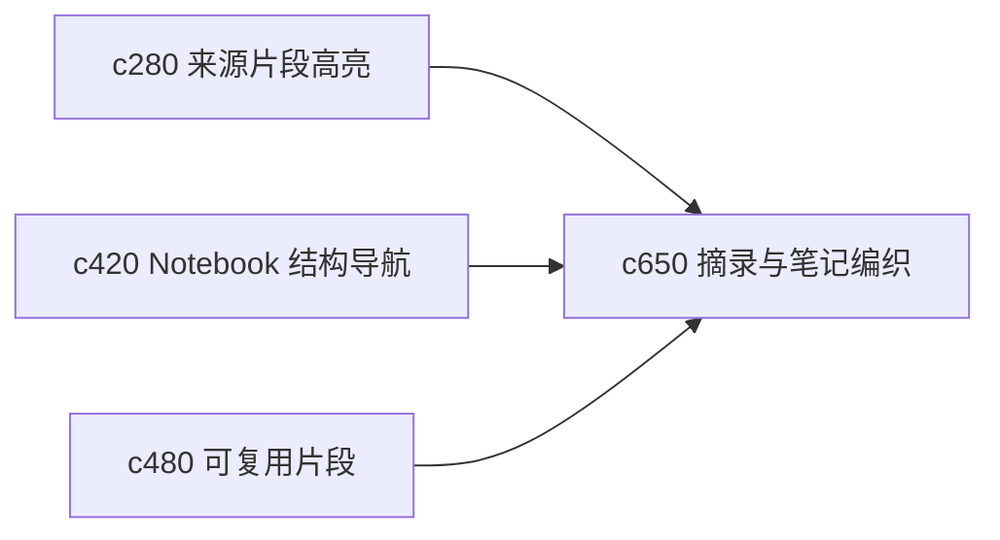

## Why

很多时候用户并不想立刻生成完整输出，而是先把关键原话摘出来，再织进自己的笔记结构里。现在 quote、note 和 source 的关系还不够顺手，容易从“做笔记”滑回“重新找一遍”。

## What Changes

- 定义 quote clipping，让用户能把来源片段直接收成可追溯的摘录对象。
- 增加 note weaving，把摘录、个人批注和 notebook block 组织成一个连续编织过程。
- 支持从阅读队列、来源详情和引用修复入口快速创建摘录。
- 让摘录对象天然带 citation anchor 和上下文，不再需要二次手工补链。

## Capabilities

### New Capabilities
- `quote-clipping-and-note-weaving`: 定义摘录对象、摘录到笔记的编织链路和引用继承规则。

### Modified Capabilities
- `source-segment-highlighting-and-inline-notes`: 片段高亮需要能直接生成摘录。
- `notebook-outline-backlinks-and-structural-navigation`: 结构导航需要识别摘录与原来源的反链。
- `notebook-fragments-and-reusable-snippets`: 可复用片段需要能消费摘录对象。

## Impact

- Backend：会影响摘录对象模型、锚点继承和 block 关联关系。
- Frontend：会影响来源阅读器、笔记编写区和引用插入流程。
- Dependencies：这条线承接 `c280`、`c420`、`c480`，会让“先摘录再组织”成为更自然的个人研究路径。

