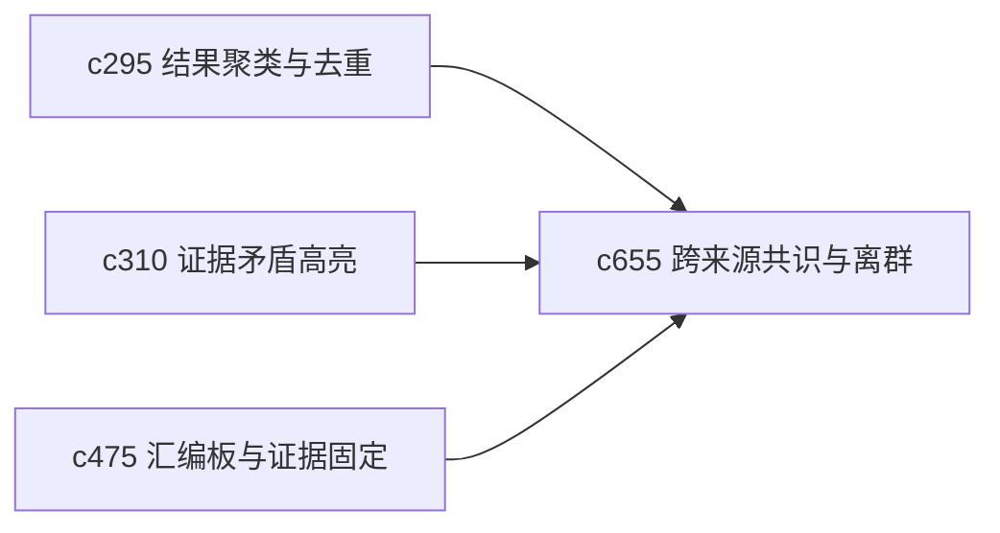

## Why

当来源数量上来之后，用户会自然关心两件事：主流说法大体一致吗，以及有没有少数来源在说完全不同的话。没有这个层面，系统就只能告诉用户“搜到了很多”，却很难帮助用户判断格局。

## What Changes

- 定义 cross-source consensus view，把多个来源之间的共同点、分歧点和明显离群项整理出来。
- 增加 outlier detection，突出那些与多数来源不一致但可能值得复核的内容。
- 支持从共识视图回钻到具体来源片段、引用和 resolution note。
- 让 consensus 不是简单投票，而是综合来源质量、时效和独立性。

## Capabilities

### New Capabilities
- `consensus-outlier-detection-across-sources`: 定义跨来源共识图、离群识别和分歧回钻面。

### Modified Capabilities
- `retrieval-result-clustering-and-duplicate-collapse`: 聚类结果需要成为共识判断的输入。
- `evidence-contradiction-highlights-and-resolution-notes`: 分歧说明需要接住离群项复核。
- `briefing-assembly-board-and-evidence-pinning`: 汇编板需要能直接固定共识或离群证据。

## Impact

- Backend：会影响来源比对、聚类摘要和共识计算。
- Frontend：会影响检索结果、证据板和争议点查看器。
- Dependencies：这条线会把 `c295`、`c310`、`c475` 串成一条更强的判断辅助链。

