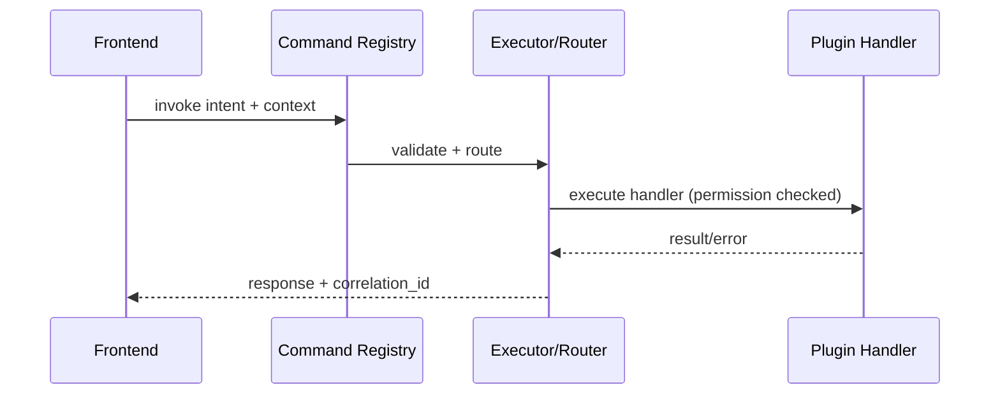

## Why

Command Registry 一旦变成“系统的动作入口”，它就会自然膨胀：越来越多的 panel、插件、自动化都想挂进来。如果缺少 intent 路由、权限边界和可组合性，命令体系最后会变成一坨难以维护的 if/else。

我们需要把命令当成契约：它是什么、需要什么上下文、会产生什么副作用、失败时怎么解释。

## What Changes

- 定义 command schema（最小但完整）：
  - `command_id`、`intent`、`requires_context`、`side_effects`、`dry_run`（可选）
  - 统一错误码与恢复动作提示（与 `c34` 共享映射）
- 引入 intent routing：
  - 前端发的是 intent（例如“生成一份 briefing”），后端/编排层决定具体动作组合
  - 允许插件注册“处理某类 intent”的 handler（但需要权限边界）
- 明确权限/沙盒边界：
  - 哪些命令只允许 dev/local
  - 哪些命令需要用户确认（后续可与 UI 交互式审批联动，但这里先定契约）

## Capabilities

### New Capabilities

- `command-intent-routing-and-permissions`: 命令 schema、intent 路由、权限边界与可组合性契约。

### Modified Capabilities

- `workspace-command-registry`: 命令注册、发现、参数校验与错误表达要求。
- `workspace-api-contract`: 命令调用的请求/响应结构与幂等（建议复用 client_request_id）。
- `architecture-plugin-and-agent`: 插件/智能体注册 command handler 的边界与隔离要求。

## Impact

- Backend：命令执行会更可组合；也更容易统一审计与诊断（引用 `c12`/`c30`）。
- Frontend：命令入口更一致；Command Palette/快捷键体系会更顺。
- Dependencies：建议先落地 `c08` 的对象/上下文约定，否则命令上下文会持续发散。

## Dependency Sketch

