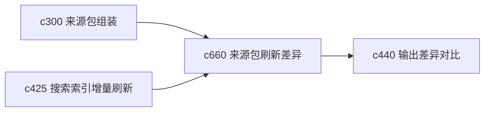

## Why

来源包一旦开始长期维护，用户就会关心“这次刷新到底变了什么”。如果刷新完只得到一个新的集合，而没有变化摘要，用户很难判断是应该重新通读，还是只要看少量新增和关键变化。

## What Changes

- 定义 source pack refresh diff，比对来源包刷新前后的新增、消失、变旧和风险变化。
- 增加 refresh brief，用短摘要解释“这次最值得关注的变化是什么”。
- 支持把变化摘要回接到 watchlist、阅读队列和证据差异，而不是变成孤立的刷新日志。
- 区分“内容变化”“可信信号变化”“结构变化”这几种刷新差异。

## Capabilities

### New Capabilities
- `source-pack-refresh-diff-and-brief`: 定义来源包刷新差异、变化摘要和重读建议。

### Modified Capabilities
- `source-pack-assembly-and-topic-watchlists`: 来源包需要表达刷新前后版本关系。
- `search-index-incremental-refresh-and-staleness-diagnostics`: 增量刷新需要暴露足够的差异上下文。
- `output-diff-compare-and-version-review`: 输出对比需要能引用来源包刷新背景。

## Impact

- Backend：会影响来源包版本化、刷新差异计算和摘要生成。
- Frontend：会影响来源包详情、观察列表和“本次变化”提示面板。
- Dependencies：这条线会把 `c300`、`c425`、`c440` 连起来，让长期来源维护更可判断。

