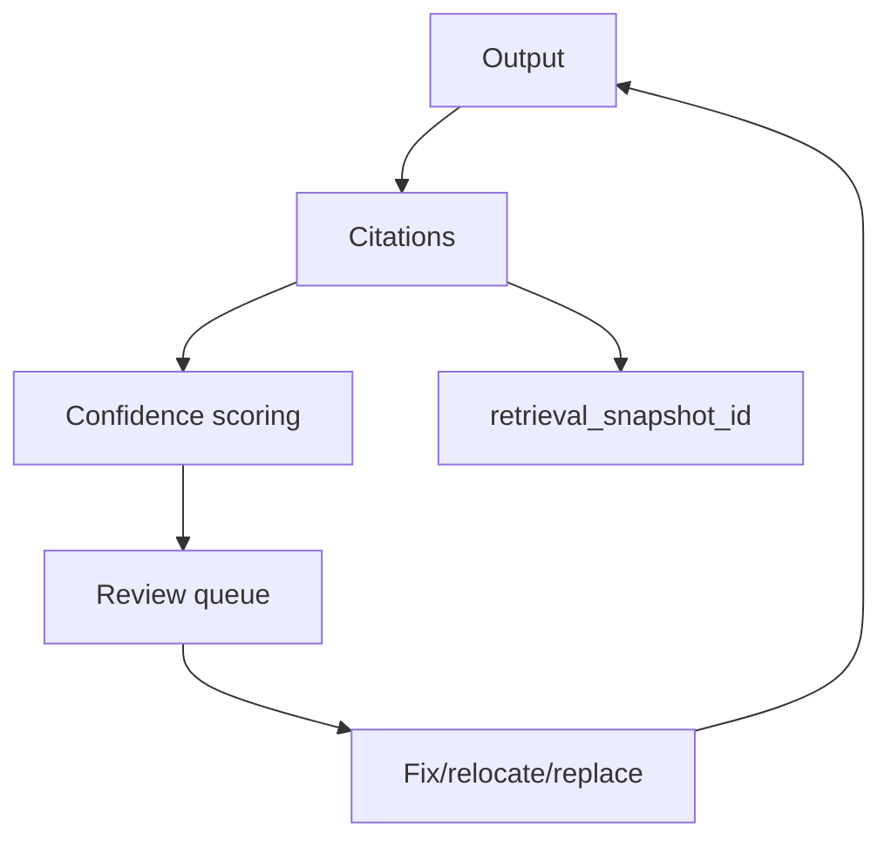

## Why

Notebook-centric 的 AI 工作台，最后拼的就是“证据感”。引用（citations）如果不稳，用户再喜欢功能也会不信结果。现在引用往往是“有就算”，但缺少两个关键能力：可信度（confidence）与可修复性（review/fix）。

这份 change 想把引用质量变成可运营的东西：低质量引用进入 review 队列，高质量引用能被复用与回归。

## What Changes

- 定义 citation anchor 与 confidence：
  - anchor 至少包含：source 标识、定位信息（offset/selector）、snapshot_id（如有）、以及 `confidence`（0~1）
  - 对低 confidence 的引用给出原因（定位失败、来源不可达、片段过短等）
- 引入 citation review queue：
  - 把“低 confidence / 无引用但需要引用”的输出列入队列
  - UI 提供修复入口：重新定位、替换引用、补充来源
- 与检索快照与评测联动：
  - 引用应能关联 `retrieval_snapshot_id`（引用 `c26`），便于追溯“当时为什么这么选”
  - 引用质量进入 `c27` 的 scorecard（先提示，后门禁）

## Capabilities

### New Capabilities

- `citation-anchor-confidence-and-review-queue`: anchor/confidence、review queue 与修复动作契约。

### Modified Capabilities

- `evidence-review-workflow`: review 的入口、队列结构与修复后的落盘规则。
- `output-rendering-and-typing`: 引用在 UI 的展示与跳转要求（能回到 source）。
- `retrieval-and-cache`: citation 与检索快照的关联字段与复放支持。
- `quality-and-regression`: 引用质量指标与回归样本捕获（关联 `c27`/`c28`）。

## Impact

- Frontend：会新增一个 review 队列页面/面板，但它能极大提高“修复一次、以后不再错”的效率。
- Backend：需要输出 confidence 与原因；并支持引用定位重试。
- Dependencies：建议先有 `c26` 的检索快照与 `c63` 的输出渲染统一，这样 review 的信息才能一致、好展示。

## Dependency Sketch

