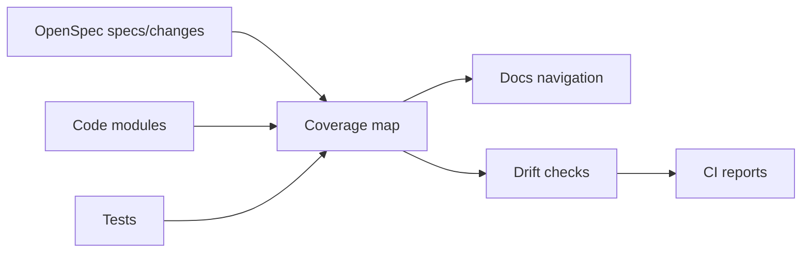

## Why

我们已经有 specs、changes、docs、生成文件、注入块……系统越成熟，越容易出现“看起来都对，但实际上已经漂了”：文档说一套、代码做一套、生成产物又是另一套。等发现时，往往已经很难追溯是从哪次改动开始偏的。

这份 change 的目标很务实：把 doc/spec/code 的一致性变成可检查的、可定位的、可持续维护的东西。

## What Changes

- 收口并固化 drift checks（作为仓库的常规门禁）：
  - docs drift / doc governance check
  - openspec validate（changes/specs）
  - OpenAPI/client drift（引用 `c32`）
- 引入 spec ↔ code ↔ tests 的 coverage map（先做“可见”，再做“约束”）：
  - 每个 spec 标注对应代码模块路径与关键入口
  - 能显示哪些 spec 没有测试、哪些模块缺 spec
- 提供导航入口：
  - 让人能从“某个 capability”直接跳到相关 change、代码位置与验证命令
  - 避免 specs/changes 变成孤岛

## Capabilities

### New Capabilities

- `spec-doc-code-coverage-map`: drift checks 清单、coverage map 的结构与导航入口。

### Modified Capabilities

- `doc-governance`: 生成/注入规则、SSOT 与检查命令的要求。
- `docs-site`: 文档站点如何展示 specs/changes/coverage 信息。
- `delivery-and-deployment`: drift checks 在 CI 的标准入口与失败输出规范。
- `public-repo-hygiene`: 变更说明、生成产物与检查清单的最小规范。

## Impact

- DX：会多一些检查命令，但它们能显著减少“过了两周才发现文档漂了”的返工。
- Docs/Specs：维护成本会更可控；也更容易 onboarding 新贡献者。
- Dependencies：建议与 `c32` 的 OpenAPI/client 门禁联动推进，形成完整的“契约-产物-检查”闭环。

## Dependency Sketch

