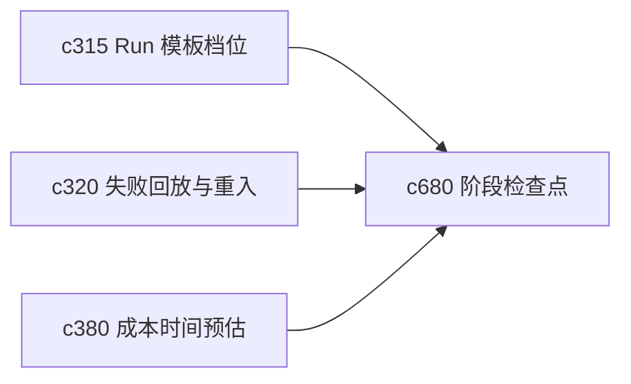

## Why

很多 run 不是一口气跑完就最好。用户常常会想在“开始生成前”“大纲出来后”“证据装配后”先看一眼，再决定是否继续。没有阶段检查点，run 要么太黑盒，要么只能靠手动拆任务。

## What Changes

- 定义 run stage checkpoint，把长 run 切成几个可理解、可中断、可确认的阶段。
- 增加 approval gate，让用户在关键阶段决定继续、回退、换模板或补来源。
- 支持默认自动通过和手动拦截两种模式，避免所有 run 都变慢。
- 让阶段门与恢复、重试和 postmortem 共享同一套阶段语义。

## Capabilities

### New Capabilities
- `run-stage-checkpoints-and-approval-gates`: 定义 run 阶段检查点、继续条件和人工确认门。

### Modified Capabilities
- `run-template-profiles-and-resume-defaults`: 模板档位需要表达阶段切分策略。
- `research-run-failure-replay-and-step-reentry`: 失败回放需要对齐阶段级重入。
- `run-cost-time-estimates-and-interrupt-points`: 中断点估算需要和阶段门统一。

## Impact

- Backend：会影响 run orchestration、阶段状态和恢复控制。
- Frontend：会影响 run 面板、继续按钮和阶段说明。
- Dependencies：这条线会把 `c315`、`c320`、`c380` 收成一条更可控的个人执行体验。

