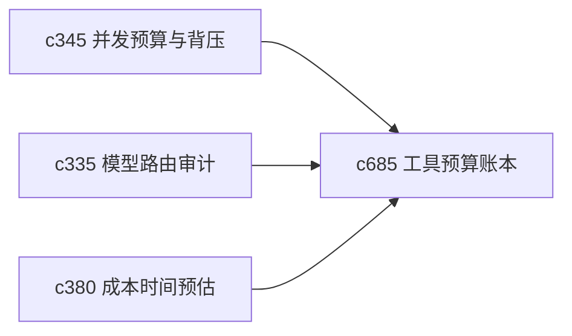

## Why

用户能接受耗时和耗费，但前提是知道这些成本到底花在了哪里。现在成本感知更多停在 run 级别，还缺少“哪一步最贵、哪个工具最慢、哪类组合最容易失控”的账本视角。

## What Changes

- 定义 tool budget ledger，把 token、耗时、外部调用和失败重试成本按步骤归因。
- 增加 step cost attribution，让 run 不再只有总成本，而有更细的成本切片。
- 支持把账本结果回给模板选择、路由解释和 postmortem 总结。
- 区分“必要成本”和“回退造成的额外成本”，方便优化优先级判断。

## Capabilities

### New Capabilities
- `tool-budget-ledger-and-step-cost-attribution`: 定义工具账本、步骤归因和成本解释。

### Modified Capabilities
- `concurrency-budgets-and-backpressure-visibility`: 并发预算需要落到步骤账本。
- `model-route-audit-and-decision-explanations`: 路由解释需要能展示成本后果。
- `run-cost-time-estimates-and-interrupt-points`: 估算模块需要引用历史账本数据。

## Impact

- Backend：会影响 run telemetry、步骤级指标聚合和预算存储。
- Frontend：会影响 run 详情、成本提示和优化建议视图。
- Dependencies：这条线接在 `c345`、`c335`、`c380` 后面，是 run 可解释性进一步细化的补件。

