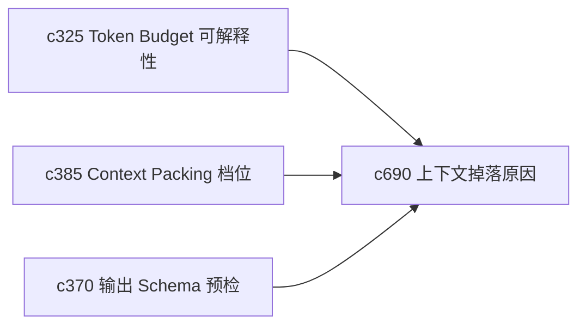

## Why

上下文装配超长时，真正让人不安的不是“被裁掉了”，而是“我不知道裁掉了什么，也不知道该怎么补救”。没有掉落原因和恢复动作，token budget explainability 只能算看到了一半。

## What Changes

- 定义 context drop reason，明确是因为长度、重复、低权重、格式不兼容还是时效性问题而被排除。
- 增加 recovery action，给出“压缩后再试”“改用摘要”“提升优先级”“拆成两次 run”这类补救建议。
- 支持按来源、片段、摘录和 note block 展示上下文去留原因。
- 让掉落信息能回流到阅读队列、摘录编织和 run 模板调参。

## Capabilities

### New Capabilities
- `context-assembly-drop-reasons-and-recovery-actions`: 定义上下文掉落解释和补救动作。

### Modified Capabilities
- `context-packing-and-token-budget-explainability`: 需要从总量解释深入到对象级掉落原因。
- `context-window-packing-profiles-and-overflow-strategies`: overflow 策略需要能产出恢复建议。
- `preflight-output-schema-compatibility-checks`: 预检阶段需要提前暴露格式不兼容导致的掉落。

## Impact

- Backend：会影响 context assembly trace、装配决策记录和预检输出。
- Frontend：会影响 run 解释层、来源详情和重试建议入口。
- Dependencies：这条线承接 `c325`、`c385`、`c370`，会把“上下文为什么这样”讲得更透。

