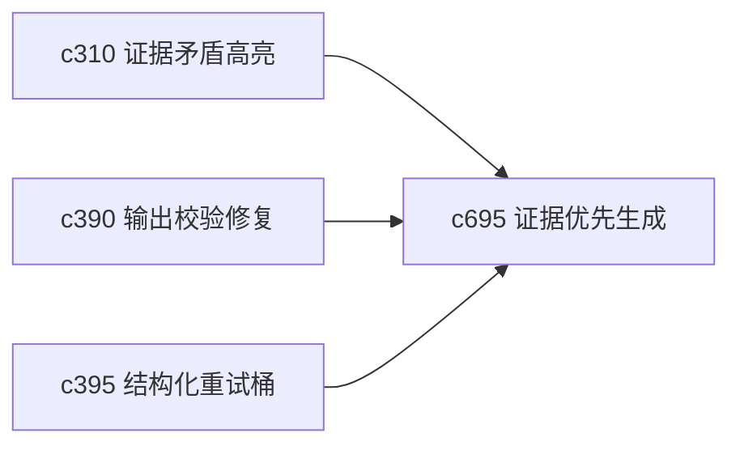

## Why

当用户在做偏研究型输出时，最怕的不是生成慢，而是生成太顺、太敢说。系统已经有引用、修复和重试能力，但还缺一个更明确的“先证据、后结论”的保守生成模式。

## What Changes

- 定义 evidence-first generation mode，在生成前优先锁定可用证据和主张强弱。
- 增加 unsafe claim brake，对高风险跳跃、证据不足和过度确定语气进行拦截或降级提示。
- 支持按输出类型切换保守程度，不把所有生成都一刀切成最慢最严的模式。
- 让安全刹车结果能进入修复、复核和 postmortem，而不是只弹一次提示。

## Capabilities

### New Capabilities
- `evidence-first-generation-modes-and-unsafe-claim-brakes`: 定义证据优先生成模式和高风险主张刹车机制。

### Modified Capabilities
- `evidence-contradiction-highlights-and-resolution-notes`: 矛盾证据需要直接影响保守模式。
- `output-validation-repair-and-self-heal`: 输出修复需要区分格式问题与主张风险问题。
- `structured-generation-retry-buckets-and-error-taxonomy`: 错误分类需要增加高风险表达桶。

## Impact

- Backend：会影响生成前校验、风险分级和重试策略选择。
- Frontend：会影响生成配置、风险提示和复核视图。
- Dependencies：这条线把 `c310`、`c390`、`c395` 向“更可信输出”方向再推进一层。

