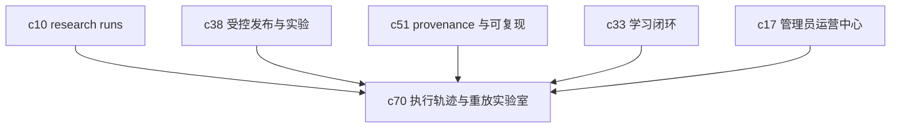

## Why

前面的路线已经在做 research run、实验治理、provenance 和学习闭环，但对真实使用者来说，很多时候最想问的其实很朴素: 它为什么这样做，哪一步开始偏了，能不能拿同一份上下文再跑一次看看。如果这些信息只散在日志、审计和内部诊断里，就很难变成真正可用的产品能力。

## What Changes

- 引入 execution trace，把检索、模型路由、工具调用、外部动作、人工接管和关键决策串成一条可读链路。
- 为结果、run 和 action 提供 explainability summary，用自然语言说明"为什么用了这些来源、这个模型、这条动作路径"。
- 支持从 checkpoint、输入快照或已发布版本发起 replay，对比两次执行差异，而不是只能看静态日志。
- 提供调试视角和安全视角的分层暴露，避免把底层细节一股脑扔给所有人。
- 把这条线和 `c51` 区分开来: `c51` 解决可复现素材的保存，`c70` 解决人怎么读懂、复盘和重放这些素材。

## Capabilities

### New Capabilities

- `execution-trace-and-replay-lab`: 定义执行轨迹、可解释摘要、重放入口和差异复盘语义。

### Modified Capabilities

- `agentic-research-runs`: 需要暴露步骤级状态、决策节点和 checkpoint 可回放语义。
- `provenance-and-reproducible-runs`: 需要从存证扩展到面向人类的回放和对比消费方式。
- `controlled-rollouts-and-experimentation-governance`: 需要支持用 replay 做回归核验和实验解释。
- `learning-loop-from-review-and-usage`: 需要消费 replay 与 explainability 数据做策略校准。
- `admin-observability-and-operations-center`: 需要提供执行异常、重放入口和诊断汇总。

## Impact

- Backend：需要新增 trace store、replay planner、diff engine 和 explainability summary 生成逻辑。
- Frontend/Admin：需要补时间线、步骤详情、回放控制、差异对比和权限分层界面。
- Product：这条线会明显提升可诊断性，也能降低"系统很黑箱"的感受。
- Dependencies：建议接在 `c10-agentic-research-runs`、`c38-controlled-rollouts-and-experimentation-governance`、`c51-provenance-and-reproducible-runs`、`c33-learning-loop-from-review-and-usage-signals`、`c17-admin-observability-and-operations-center` 之后。

## Dependency Sketch

