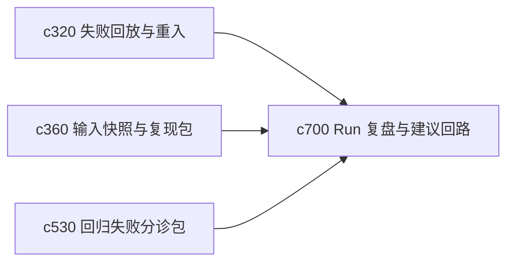

## Why

一次 run 做完以后，用户通常并不只关心结果，还想知道这次为什么顺、为什么卡、下次要不要换一种做法。如果 run 结束就散了，系统就很难形成真正的个人使用学习回路。

## What Changes

- 定义 run postmortem summary，对一次执行的关键步骤、阻塞点、代价和结果质量做简要复盘。
- 增加 recommendation loop，把这次经验沉淀成下次可直接采纳的建议。
- 支持把 postmortem 挂回模板、来源包和长线线程，而不是只停留在单次 run 历史。
- 区分“建议用户改操作”和“建议系统改默认值”两类后续动作。

## Capabilities

### New Capabilities
- `run-postmortem-summaries-and-recommendation-loops`: 定义执行复盘摘要、建议回路和经验沉淀入口。

### Modified Capabilities
- `research-run-failure-replay-and-step-reentry`: 回放页需要接住复盘视角。
- `run-input-snapshots-and-repro-packs`: 输入快照需要成为复盘的证据包。
- `regression-failure-triage-bundles-and-shareable-reports`: 分诊包需要能复用 run 复盘内容。

## Impact

- Backend：会影响 run summary、建议生成和经验索引。
- Frontend：会影响 run 结束页、历史详情和模板优化提示。
- Dependencies：这条线接在 `c320`、`c360`、`c530` 后面，把单次执行变成长期可学习对象。

