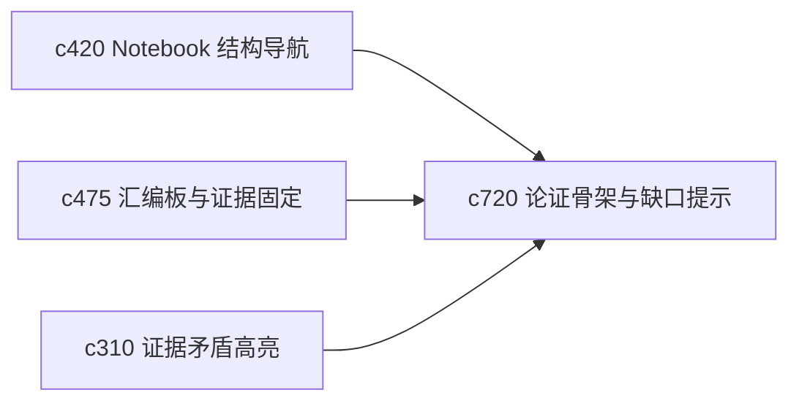

## Why

有些用户不是不会写，而是不想每次都从零组织论证骨架。系统现在已经能做大纲和汇编，但还缺一个介于“素材堆”和“完整成稿”之间的中间层，帮助用户先站稳论证框架。

## What Changes

- 定义 argument skeleton，把大纲节点提升为“主张、支撑、反例、待补证据”的结构化骨架。
- 增加 gap prompt，在骨架层直接提示哪里还缺论据、哪里只有结论没有支撑。
- 支持 skeleton 与 briefing board、notebook outline 和 output template 互转。
- 让用户能在骨架层做轻编辑，而不是每次都跳到全文编辑。

## Capabilities

### New Capabilities
- `outline-to-argument-skeleton-and-gap-prompts`: 定义论证骨架、缺口提示和骨架级编辑视图。

### Modified Capabilities
- `notebook-outline-backlinks-and-structural-navigation`: 结构导航需要升级到论证层节点。
- `briefing-assembly-board-and-evidence-pinning`: 汇编板需要能直接喂给论证骨架。
- `evidence-contradiction-highlights-and-resolution-notes`: 证据矛盾需要在骨架层暴露缺口。

## Impact

- Backend：会影响结构化中间表示、骨架推导和缺口诊断。
- Frontend：会影响大纲编辑器、汇编板和成稿前工作面。
- Dependencies：这条线建立在 `c420`、`c475`、`c310` 上，是从“组织素材”到“组织论证”的关键过渡。

