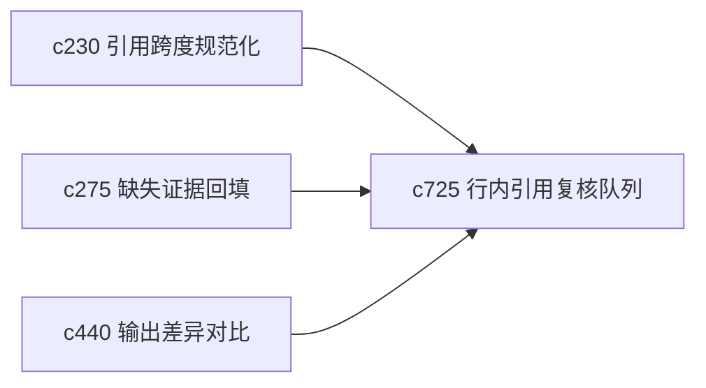

## Why

引用问题往往不是一两处，而是一串连续的小裂缝：这里锚点丢了，那里跨度不准，另一段引用虽然存在但不够贴。没有一个面向全文的修引用队列，用户会在局部来回补，效率很差。

## What Changes

- 定义 inline citation review queue，把全文里待复核、待补锚和待替换的引用收成一个连续处理队列。
- 增加 fix sweep，允许用户按章节或按问题类型成批清理引用问题。
- 支持从差异对比、引用修复和 block 编辑入口汇总问题，而不是每处单独修。
- 明确“锚点缺失”“跨度不准”“证据变旧”“引用不够支撑”这几类问题。

## Capabilities

### New Capabilities
- `inline-citation-review-queue-and-fix-sweeps`: 定义全文引用复核队列和批量修复流程。

### Modified Capabilities
- `citation-span-normalization-and-source-anchoring`: 锚点规范化需要暴露待修问题列表。
- `citation-backfill-and-missing-evidence-repair`: 回填修复需要能进入批量清理。
- `output-diff-compare-and-version-review`: 差异视图需要标出新增或恶化的引用问题。

## Impact

- Backend：会影响引用问题聚合、章节级修复和问题分类。
- Frontend：会影响编辑器侧边队列、章节复核入口和批量修复面板。
- Dependencies：这条线承接 `c230`、`c275`、`c440`，把引用修复从“点状补洞”推进到“整体验收”。

