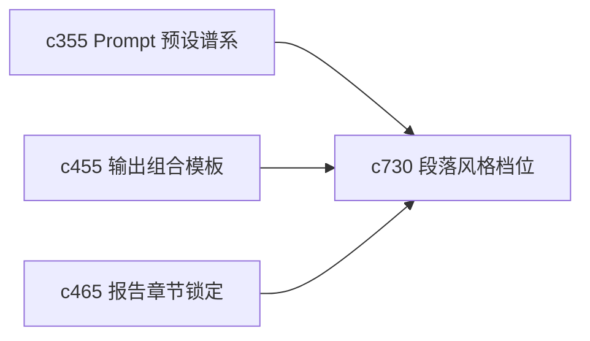

## Why

个人写作不只是“能写出来”，还在意不同场景该用什么力度、什么口气、什么段落节奏。现在风格更多停在 prompt 或模板层，缺少“按章节控制表达”的细粒度约束。

## What Changes

- 定义 section style profile，让不同章节可以选择不同的表达档位与语气边界。
- 增加 tone guard，对过度夸张、过早下判断和不合预期的表达风格做轻约束。
- 支持 profile 与 output template、durable rule 和 section lock 协同，而不是各自生效。
- 让风格控制可见、可复核、可按章节覆盖，不变成新的黑盒。

## Capabilities

### New Capabilities
- `section-style-profiles-and-tone-guards`: 定义章节风格档位、语气护栏和局部覆盖规则。

### Modified Capabilities
- `prompt-preset-lineage-and-migration`: 需要区分全局 prompt 与章节风格档位。
- `output-composition-templates-and-layout-guards`: 模板层需要能声明默认风格结构。
- `report-section-locking-and-incremental-regeneration`: 锁定与局部重生需要保留章节风格。

## Impact

- Backend：会影响生成参数装配、章节级规则叠加和风格元数据。
- Frontend：会影响章节设置、风格说明和局部重生入口。
- Dependencies：这条线承接 `c355`、`c455`、`c465`，也会和 `c615` 的长期偏好规则自然对接。

