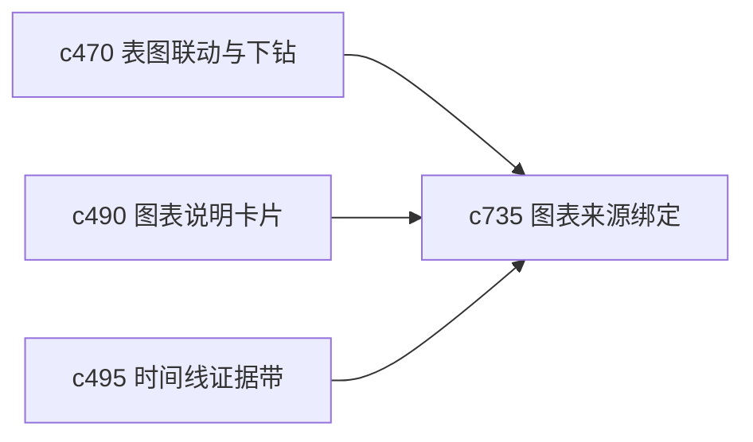

## Why

图表和表格一旦进入长期维护，最容易失控的就是“正文已经更新了，图表还在用旧证据”。如果图形产物和来源没有稳固绑定，刷新之后用户只能靠记忆去猜哪些地方需要重做。

## What Changes

- 定义 figure/table source binding，让图表、表格和它们依赖的来源片段形成显式绑定关系。
- 增加 refresh propagation，在来源更新或证据等级变化时，提示哪些图表和表格可能需要复核。
- 支持从图表回钻到来源、从来源反看受影响图表，形成双向追踪。
- 区分“数据变化”“描述变化”“可信度变化”这几种不同的刷新影响。

## Capabilities

### New Capabilities
- `figure-table-source-binding-and-refresh-propagation`: 定义图表来源绑定、刷新传播和影响提示。

### Modified Capabilities
- `table-chart-linked-selections-and-drillthrough`: 联动视图需要识别来源绑定关系。
- `chart-captioning-and-visual-summary-cards`: 图表摘要需要展示来源与刷新状态。
- `timeline-evidence-bands-and-source-drillback`: 时间线证据变化需要能波及相关图表。

## Impact

- Backend：会影响图表元数据、来源绑定和影响范围计算。
- Frontend：会影响图表详情、刷新提示和受影响对象导航。
- Dependencies：这条线承接 `c470`、`c490`、`c495`，把视觉产物纳入证据维护闭环。

