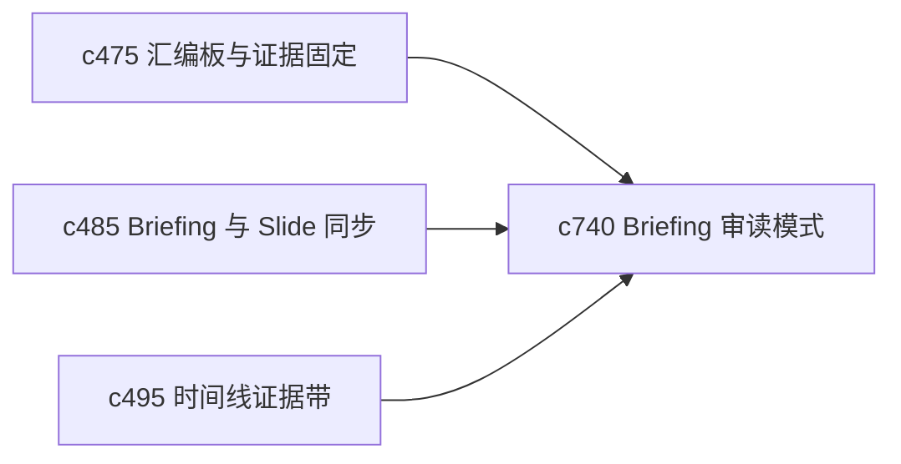

## Why

有些时候用户不是要继续编辑，而是想安静地读一遍 briefing，看它到底讲顺了没有、证据是否真能撑住。现在 briefing 更偏装配工作面，还缺少一个更像“审读模式”的视角。

## What Changes

- 定义 briefing reading mode，让 briefing 进入更连续、更低干扰的阅读视图。
- 增加 side-by-side evidence，在阅读时可以并排查看当前段落与对应证据。
- 支持按章节切换“只看正文”“正文加摘要证据”“正文加原文证据”几种强度。
- 让阅读模式和 drift hint、timeline drillback、citation queue 保持互通，而不是读完还得重新定位问题。

## Capabilities

### New Capabilities
- `briefing-reading-mode-and-side-by-side-evidence`: 定义 briefing 审读视图和并排证据阅读模式。

### Modified Capabilities
- `briefing-assembly-board-and-evidence-pinning`: 汇编板需要支持切到阅读视角。
- `briefing-to-slide-outline-sync-and-drift-hints`: drift hint 需要能在阅读模式里暴露。
- `timeline-evidence-bands-and-source-drillback`: 阅读中需要能直接回钻时间线证据。

## Impact

- Backend：会影响 briefing 渲染载荷和证据并排聚合接口。
- Frontend：会影响 briefing 查看器、阅读器布局和证据旁栏。
- Dependencies：这条线接在 `c475`、`c485`、`c495` 后面，让 briefing 从“拼装台”扩展到“认真审读面”。

