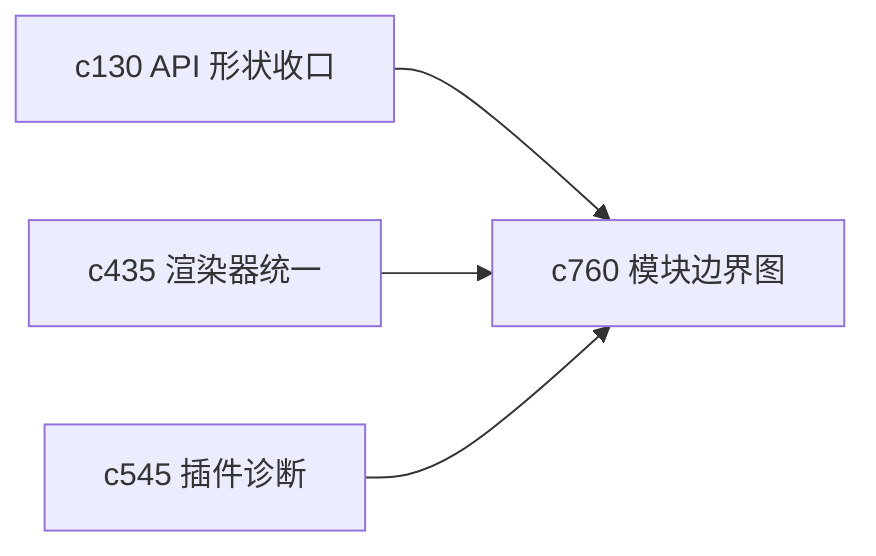

## Why

proposal 越铺越多，后面真正容易拖慢推进的，往往不是缺功能，而是边界越来越糊。当前系统里 API、渲染、状态、插件和任务链路已经逐渐复杂，如果没有更明确的模块边界图，后续 change 会越来越难落。

## What Changes

- 定义 module boundary map，把核心模块、依赖方向和禁止跨越的边界收成一张长期可维护的结构图。
- 增加 dependency pruning 语义，识别可以被收口、下沉或剥离的耦合点。
- 支持把 boundary map 对应到 OpenSpec change 依赖，而不是停留在代码结构图层。
- 让重构提案可以更明确地说清楚“这次是在修哪一条边界”。

## Capabilities

### New Capabilities
- `module-boundary-map-and-dependency-pruning`: 定义模块边界图、依赖收口和耦合修剪规则。

### Modified Capabilities
- `api-shape-consolidation-and-generated-client-slimming`: API 收口需要纳入边界图视角。
- `output-renderer-unification-and-plugin-bundle-splitting`: 渲染与插件分拆需要更清晰的边界约束。
- `plugin-registry-health-and-compatibility-diagnostics`: 插件诊断需要知道边界预期，而不是只看运行状态。

## Impact

- Backend：会影响模块依赖梳理、接口职责归位和包边界约束。
- Frontend：会影响数据访问层、渲染层和状态共享边界。
- Dependencies：这条线接在 `c130`、`c435`、`c545` 后面，是后续架构重构类 proposal 的总导航图。

