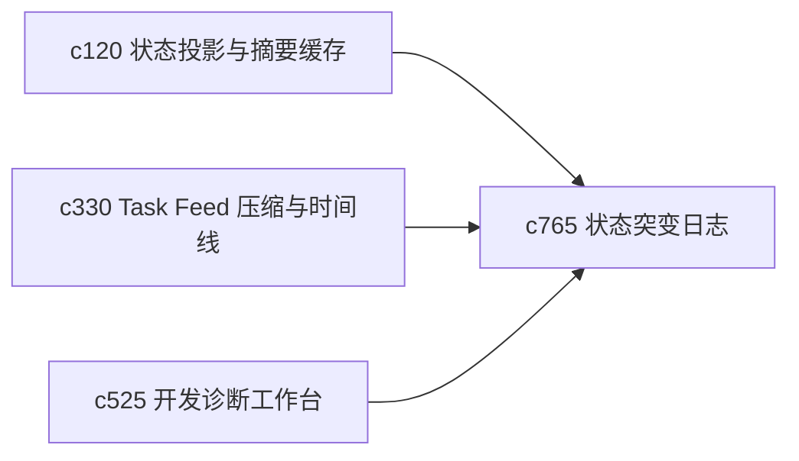

## Why

状态问题最难排的地方，不是看不到当前值，而是不知道它是怎么一步步走到这里的。现在已经有摘要、时间线和状态转储，但还缺少对关键状态突变的连续记账和回放能力。

## What Changes

- 定义 state mutation journal，对关键工作区状态变化记录“谁改了、为什么改、改前改后是什么”。
- 增加 debug rewind，让开发和诊断工作面能回看几步关键突变，而不是只拿到一个静态 dump。
- 支持把状态 journal 和任务 feed、快照、scenario fixture 对齐，形成更可靠的排障上下文。
- 区分用户动作导致的变化、系统自动变化和恢复流程导致的变化。

## Capabilities

### New Capabilities
- `state-mutation-journal-and-debug-rewind`: 定义状态突变日志、回看窗口和调试回退语义。

### Modified Capabilities
- `workspace-state-projection-and-summary-cache`: 状态投影需要提供可追溯的失效原因。
- `task-feed-compaction-and-event-timeline`: 事件时间线需要能引用关键状态突变。
- `dev-diagnostics-workbench-and-state-dumps`: 状态转储需要能连回 mutation journal。

## Impact

- Backend：会影响状态事件采样、差异记录和调试查询接口。
- Frontend：会影响开发诊断台、事件时间线和状态解释面板。
- Dependencies：这条线承接 `c120`、`c330`、`c525`，会把“看状态”推进到“看状态是怎么变成这样的”。

