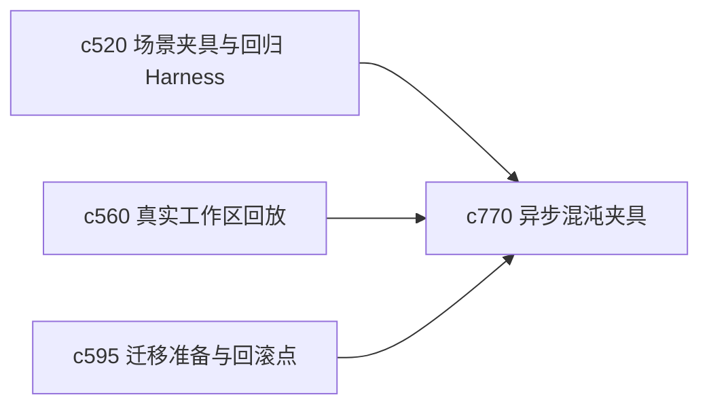

## Why

异步链路越多，越容易在“平时都没事，一到边界就出事”。如果只靠真实故障来暴露问题，代价会很高。当前已有场景夹具、回放和最小化数据，但还缺少专门打异步恢复链路的混沌夹具。

## What Changes

- 定义 chaos fixture，用可控方式模拟超时、重复回调、部分成功、乱序完成和恢复中断。
- 增加 recovery checks，专门验证异步管线在坏场景下是否还能收敛。
- 支持把 chaos fixture 接到回放、smoke test 和 migration readiness，而不是单独存在。
- 让混沌场景尽量小、可重复、可本地运行，避免演变成重型平台化方案。

## Capabilities

### New Capabilities
- `chaos-fixtures-for-async-pipelines-and-recovery`: 定义异步混沌夹具、故障模式和恢复检查语义。

### Modified Capabilities
- `workspace-scenario-fixtures-and-regression-harness`: 场景夹具需要支持异步故障注入。
- `real-workspace-eval-dataset-capture-and-replay`: 回放数据需要可绑定混沌模式。
- `migration-readiness-report-and-rollback-checkpoints`: 迁移准备报告需要纳入恢复链路压测结果。

## Impact

- Backend：会影响任务执行器测试、故障注入和恢复校验逻辑。
- Frontend：主要影响开发态诊断和测试可视化，不直接改变用户主路径。
- Dependencies：这条线会把 `c520`、`c560`、`c595` 串起来，让异步恢复能力有更扎实的验证底座。

