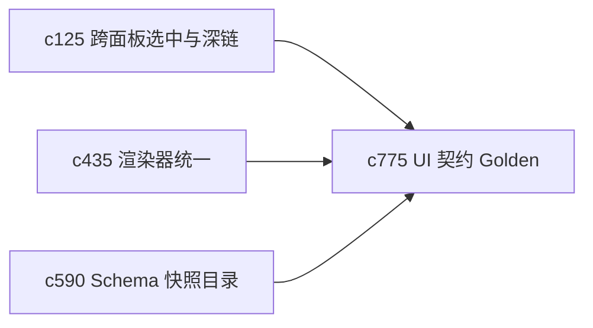

## Why

很多体验退化不是“页面挂了”，而是结构 quietly 漂了：字段顺序变了、壳层状态少了、渲染器输出不一致了。没有一组稳定的 UI contract golden，前后端都很难在重构时及时发现这种漂移。

## What Changes

- 定义 UI contract golden recording，把关键工作面和关键数据载荷录成长期基线。
- 增加 drift alert，在接口形状、视图结构或关键交互状态变化时给出预警。
- 支持 golden 基线和 OpenAPI drift、schema snapshot、renderer contract 联动。
- 把重点放在“关键工作面不悄悄变样”，而不是追求脆弱的大面积截图测试。

## Capabilities

### New Capabilities
- `ui-contract-golden-recordings-and-drift-alerts`: 定义关键 UI 契约基线、漂移预警和复核流程。

### Modified Capabilities
- `cross-panel-selection-and-deep-link-contract`: 深链和选中契约需要纳入 UI 基线。
- `output-renderer-unification-and-plugin-bundle-splitting`: 渲染输出需要能生成稳定 golden 记录。
- `schema-snapshot-catalog-and-regression-baselines`: schema 基线需要和 UI 契约互相参照。

## Impact

- Backend：会影响关键载荷快照、契约基线生成和回归校验。
- Frontend：会影响关键视图录制、漂移提示和验收流程。
- Dependencies：这条线把 `c125`、`c435`、`c590` 收成一套更实用的重构护栏。

