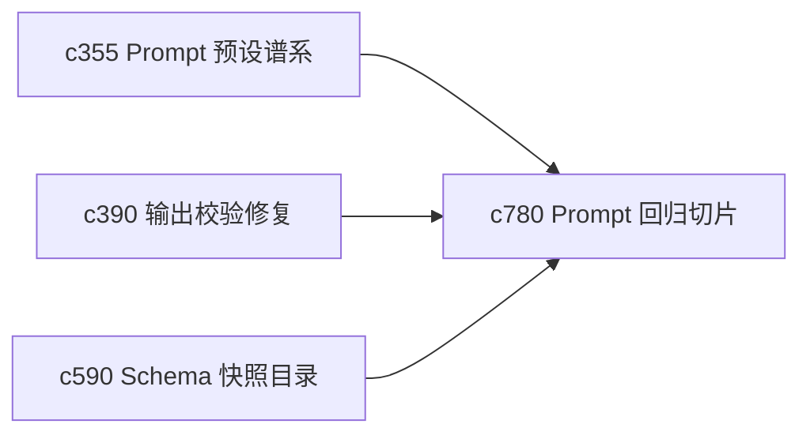

## Why

Prompt 类回归的麻烦在于，它经常不是彻底失效，而是某一类输入、某一种章节、某一档风格开始悄悄变差。没有更细粒度的回归切片和失败指纹，问题会一直显得“偶发”。

## What Changes

- 定义 prompt regression slice，按输出类型、章节角色、证据强度和上下文规模切出更细的回归面。
- 增加 failure fingerprint，把常见失败模式收成可对照的指纹，而不是只留原始报错。
- 支持指纹回接到 retry bucket、postmortem 和 durable rule，帮助更快定位失配原因。
- 让回归切片尽量围绕真实个人工作样本，而不是空洞 benchmark。

## Capabilities

### New Capabilities
- `prompt-regression-slices-and-failure-fingerprints`: 定义 prompt 回归切片、失败指纹和定位线索。

### Modified Capabilities
- `prompt-preset-lineage-and-migration`: 预设迁移需要附带回归切片结果。
- `output-validation-repair-and-self-heal`: 输出修复需要标记命中的失败指纹。
- `schema-snapshot-catalog-and-regression-baselines`: 回归基线需要纳入 prompt 指纹视角。

## Impact

- Backend：会影响评测切片、失败模式归类和预设变更验收。
- Frontend：会影响开发诊断、回归结果浏览和 preset 调整提示。
- Dependencies：这条线承接 `c355`、`c390`、`c590`，会把 prompt 类回归定位从“感觉不对”推进到“可归类、可复现”。

