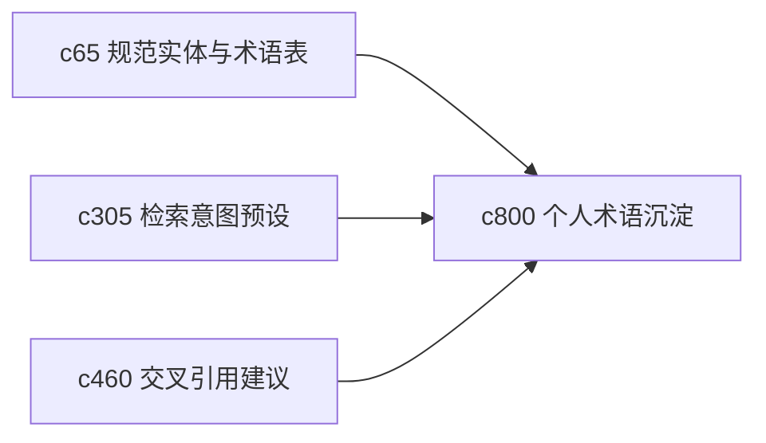

## Why

个人研究做久了，很多主题都会逐渐长出自己的一套术语、别名和习惯说法。如果系统不能把这些词慢慢沉淀下来，用户就会反复解释同一个概念，也更容易在检索、笔记和输出之间出现叫法漂移。

## What Changes

- 定义 personal glossary，让术语、别名、缩写和常用解释可以在工作区内长期积累。
- 增加 term settling 语义，支持把一段时间里逐渐稳定下来的叫法收口成优先表达。
- 让 glossary 同时服务检索、摘录、论证骨架和输出，而不是只当一个词典页。
- 支持保留历史叫法，避免术语演化后失去旧内容可追溯性。

## Capabilities

### New Capabilities
- `personal-glossary-growth-and-term-settling`: 定义个人术语表、别名沉淀和稳定叫法规则。

### Modified Capabilities
- `canonical-entities-glossary-and-semantic-resolution`: 需要扩展到个人工作区级术语沉淀。
- `retrieval-intent-presets-and-query-lens`: 检索意图需要能消费个人术语偏好。
- `notebook-cross-reference-suggestions-and-link-inference`: 交叉引用建议需要识别术语别名。

## Impact

- Backend：会影响术语索引、别名解析和工作区语义缓存。
- Frontend：会影响搜索提示、术语解释和编辑器链接建议。
- Dependencies：这条线承接 `c65`、`c305`、`c460`，会让个人知识积累更有连续性。

