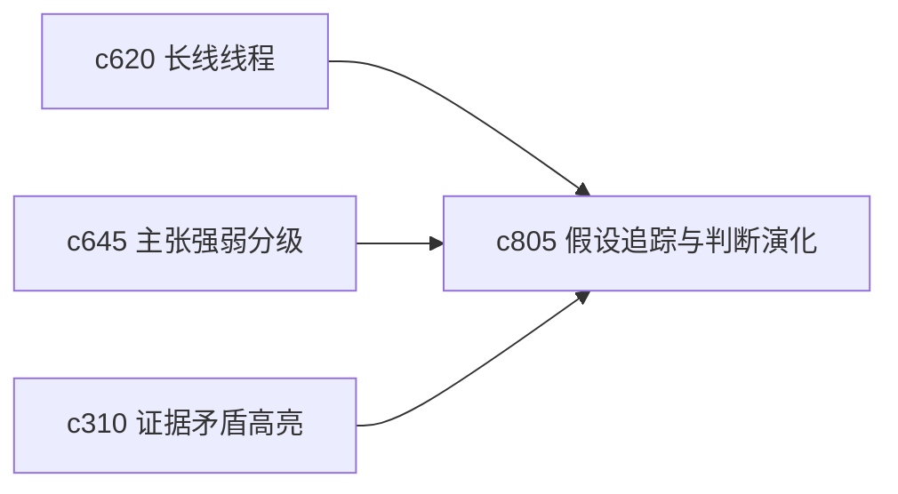

## Why

真正的研究过程通常不是直接得到结论，而是先形成假设，再逐步加证据、改判断、推翻旧看法。现在系统更擅长记录结果，还不够擅长记录“我是怎么一步步改主意的”。

## What Changes

- 定义 hypothesis object，把猜测、待证结论和阶段性判断收成可持续跟踪的对象。
- 增加 verdict evolution，记录每次判断升级、降级或推翻的原因。
- 支持把来源变化、证据矛盾和主张强弱直接反馈到假设状态。
- 让假设对象能挂在长线线程、论证骨架和 briefing 上，而不是只留在笔记里。

## Capabilities

### New Capabilities
- `hypothesis-tracking-and-verdict-evolution`: 定义研究假设、判断演化和证据触发更新。

### Modified Capabilities
- `claim-strength-grading-and-evidence-weight`: 主张强弱需要能回馈给假设状态。
- `long-arc-threads-and-milestone-checkpoints`: 长线线程需要容纳假设与阶段性判断。
- `evidence-contradiction-highlights-and-resolution-notes`: 矛盾说明需要能推动 verdict 演化。

## Impact

- Backend：会影响假设对象模型、状态演化记录和证据绑定。
- Frontend：会影响主题页、论证工作面和判断时间线。
- Dependencies：这条线接在 `c620`、`c645`、`c310` 后面，把研究过程感补得更完整。

