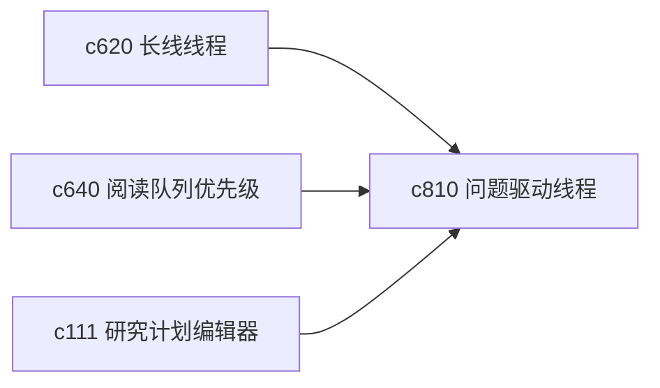

## Why

不少个人研究并不是从主题开始，而是从一个问题开始，比如“这个判断到底站不站得住”或者“这件事时间线到底怎么排”。如果系统只能围绕主题组织内容，问题导向的探索会显得很散。

## What Changes

- 定义 question-led thread，把研究问题作为一等入口，而不是附属标签。
- 增加 answer status，区分“未回答”“初步回答”“证据不足”“暂时搁置”“已形成稳定答案”。
- 支持一个问题关联多条来源链、多次 run 和多个输出版本。
- 让问题线程与长线线程和阅读队列互通，避免问题和主题裂开。

## Capabilities

### New Capabilities
- `question-led-research-threads-and-answer-status`: 定义问题驱动研究线程和答案状态语义。

### Modified Capabilities
- `long-arc-threads-and-milestone-checkpoints`: 需要支持以问题为核心的线程组织。
- `reading-queue-prioritization-and-guided-order`: 阅读优先级需要能围绕待解问题生成。
- `research-plan-editor-and-execution-checklists`: 计划编辑器需要能把问题转成执行清单。

## Impact

- Backend：会影响线程索引、问题状态和对象关系图。
- Frontend：会影响首页入口、问题详情和状态切换面板。
- Dependencies：这条线承接 `c620`、`c640` 和既有 `c111`，会让研究目标更具体。

