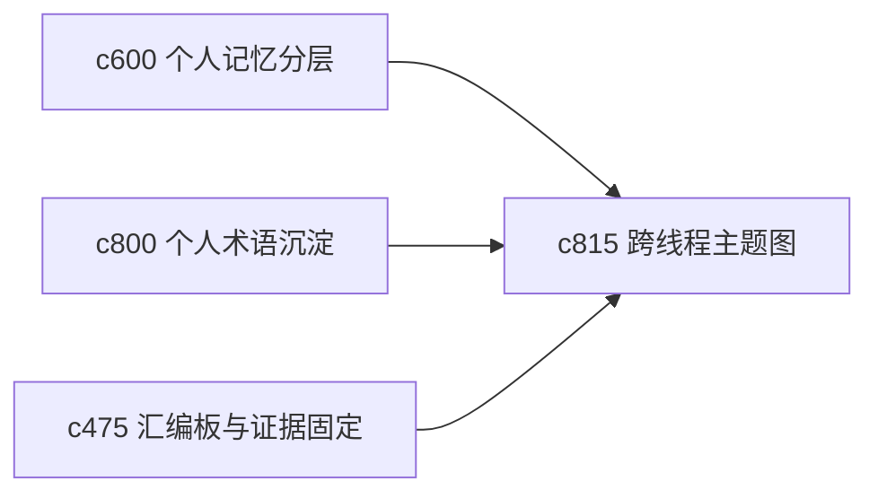

## Why

当一个人长期研究多个相近主题时，真正的价值常常出现在主题交叉地带。现在主题之间更多是列表关系，还缺少“这些线程其实共享哪些子问题、哪些概念、哪些证据簇”的地图感。

## What Changes

- 定义 cross-thread theme map，把多个线程之间共享的概念、问题和来源簇可视化出来。
- 增加 subtopic lattice，帮助用户把大主题拆成几个有层次的子主题面。
- 支持从主题地图直接跳到对应线程、摘录和论证骨架节点。
- 让主题图是轻量导航工具，不变成复杂知识图谱工程。

## Capabilities

### New Capabilities
- `cross-thread-theme-maps-and-subtopic-lattices`: 定义跨线程主题图和子主题层次结构。

### Modified Capabilities
- `personal-memory-layers-and-recall-views`: 回看视图需要支持主题地图入口。
- `personal-glossary-growth-and-term-settling`: 术语沉淀需要为主题聚类提供语义线索。
- `briefing-assembly-board-and-evidence-pinning`: 汇编板需要能消费跨主题证据簇。

## Impact

- Backend：会影响线程关系推导、子主题聚类和导航索引。
- Frontend：会影响主题地图、线程总览和跨主题跳转。
- Dependencies：这条线接在 `c600`、`c800`、`c475` 后面，更像长期个人知识梳理工具。

