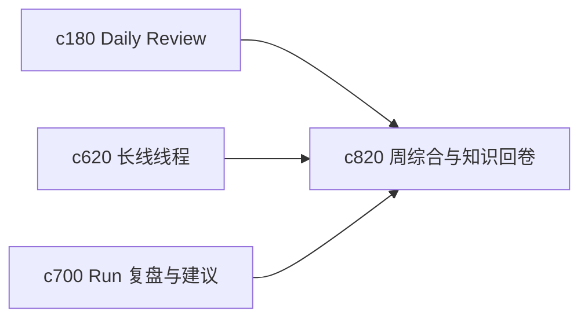

## Why

长期个人使用里，一个很常见的断裂点是：每天都在做，但一周回头看时说不清到底形成了什么新认识。没有周期性综合层，前面那些细碎积累很难真正转成知识资产。

## What Changes

- 定义 weekly synthesis，把一周里的新来源、新判断、新输出和未闭合问题收成一次周期性回卷。
- 增加 personal knowledge rollup，用简洁视图展示“本周长出来了什么”。
- 支持 rollup 回接到长线线程、问题线程和假设对象，形成阶段总结。
- 区分机械汇总和真正的新认识，尽量避免生成一堆空泛周报。

## Capabilities

### New Capabilities
- `weekly-synthesis-and-personal-knowledge-rollups`: 定义个人周期综合和知识回卷视图。

### Modified Capabilities
- `daily-review-resurfacing-and-deferred-items`: 日回看需要能汇入周综合。
- `long-arc-threads-and-milestone-checkpoints`: 长线线程需要接住周期总结节点。
- `run-postmortem-summaries-and-recommendation-loops`: run 复盘需要能为周综合提供素材。

## Impact

- Backend：会影响周期聚合、综合摘要和线程回卷索引。
- Frontend：会影响首页回顾、周综合页和阶段总结面板。
- Dependencies：这条线会把 `c180`、`c620`、`c700` 串成更有长期积累感的闭环。

