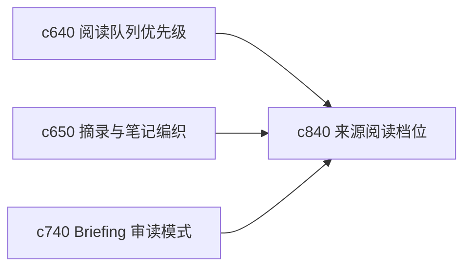

## Why

同一份来源在不同阶段需要的阅读方式并不一样。摸底时想快速扫，核证时想紧贴原文，做摘录时又想减少干扰。现在阅读体验还不够按任务强度切换。

## What Changes

- 定义 source reading mode，支持速读、核证、摘录和对照几种阅读强度。
- 增加 density control，让用户调节信息密度、注释显示和证据提示强度。
- 支持阅读模式与阅读队列、摘录编织和并排证据联动。
- 让阅读控制尽量轻，不把阅读器做成复杂 IDE。

## Capabilities

### New Capabilities
- `source-reading-modes-and-density-controls`: 定义来源阅读档位和信息密度控制。

### Modified Capabilities
- `reading-queue-prioritization-and-guided-order`: 队列需要能给出建议阅读模式。
- `quote-clipping-and-note-weaving`: 摘录流程需要能从阅读模式直接进入。
- `briefing-reading-mode-and-side-by-side-evidence`: 审读模式需要和来源阅读档位打通。

## Impact

- Backend：主要影响阅读器配置载荷和模式建议字段。
- Frontend：会影响来源阅读器、旁注显示和模式切换。
- Dependencies：这条线承接 `c640`、`c650`、`c740`，属于阅读工作面的自然深化。

