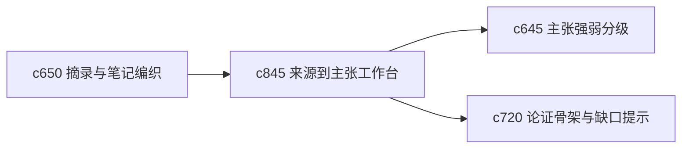

## Why

很多来源真正值钱的不是全文，而是其中哪些话能支撑哪些主张。现在系统已经有摘录和引用，但还缺一个更明确的工作面，帮助用户把“原文片段”整理成“可用主张”。

## What Changes

- 定义 source-to-claim workbench，把来源片段、候选主张和证据权重放在同一工作面里。
- 支持从来源中提取 claim candidate，并快速判断是保留、合并、降级还是丢弃。
- 让主张提取能直接进入论证骨架、假设对象和证据板。
- 保持人工可控，避免把来源自动总结成用户不认同的结论堆。

## Capabilities

### New Capabilities
- `source-to-claim-extraction-workbench`: 定义来源到主张的提取、整理和确认流程。

### Modified Capabilities
- `quote-clipping-and-note-weaving`: 摘录需要能升级为候选主张。
- `claim-strength-grading-and-evidence-weight`: 候选主张确认后需要进入强弱分级。
- `outline-to-argument-skeleton-and-gap-prompts`: 论证骨架需要能直接吸收已确认主张。

## Impact

- Backend：会影响候选主张对象、提取 trace 和确认状态。
- Frontend：会影响来源工作台、主张列表和论证构建入口。
- Dependencies：这条线承接 `c650`、`c645`、`c720`，会让证据组织更像真正的研究加工过程。

