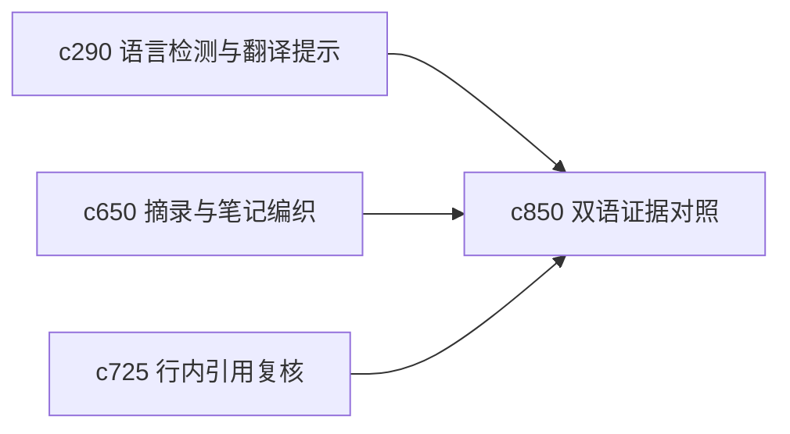

## Why

面对多语言来源时，用户既想快速理解，也怕翻译把关键语气和细节磨平。现在有语言检测和翻译提示，但还缺一个更稳的“双语对照证据面”，让用户能在理解和核证之间切换。

## What Changes

- 定义 bilingual evidence pair，把原文片段和译文片段稳定配对。
- 增加 translation comparison，突出可能影响理解的措辞差异和不确定翻译点。
- 支持双语对照进入摘录、引用和审读模式，而不是只留在来源页。
- 区分“阅读辅助翻译”和“可直接引用翻译”，避免误用。

## Capabilities

### New Capabilities
- `translation-comparison-and-bilingual-evidence-pairs`: 定义双语证据配对、译文差异提示和引用边界。

### Modified Capabilities
- `source-language-detection-and-translation-hints`: 语言检测需要升级到片段级双语对照。
- `quote-clipping-and-note-weaving`: 摘录需要保留原文与译文双轨。
- `inline-citation-review-queue-and-fix-sweeps`: 引用复核需要识别译文是否可追溯回原文。

## Impact

- Backend：会影响片段级翻译绑定、差异提示和双语锚点。
- Frontend：会影响来源阅读器、摘录面板和引用复核视图。
- Dependencies：这条线接在 `c290`、`c650`、`c725` 后面，是多语言研究时很自然的增强。

