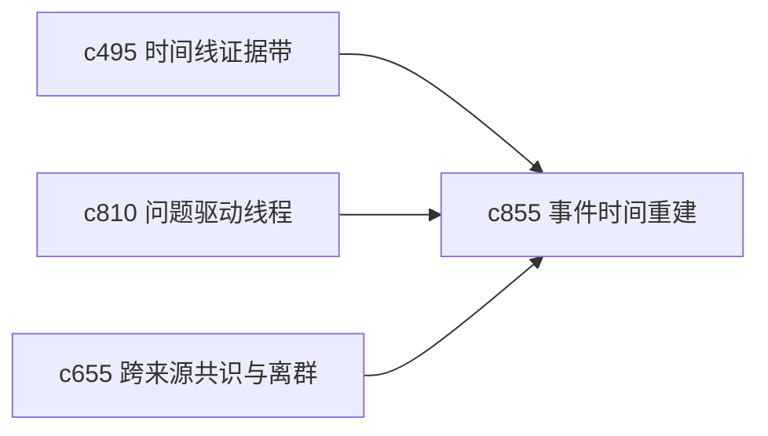

## Why

很多主题不是围绕观点，而是围绕事件演进。来源里时间信息常常分散、含糊，甚至互相矛盾。没有一个专门做时间重建的工作面，用户很难把碎片拼成可靠的事件顺序。

## What Changes

- 定义 source timeline reconstruction，从多个来源片段中提取事件、时间点和前后关系。
- 增加 event ordering，帮助用户在缺精确时间时也能先排出相对顺序。
- 支持对时间冲突和不确定区间做显式标记，而不是强行给出单一时间线。
- 让重建结果能回接到时间线证据带、问题线程和 briefing。

## Capabilities

### New Capabilities
- `source-timeline-reconstruction-and-event-ordering`: 定义事件重建、顺序推断和时间不确定性表达。

### Modified Capabilities
- `timeline-evidence-bands-and-source-drillback`: 时间线视图需要能消费重建结果。
- `question-led-research-threads-and-answer-status`: 问题线程需要支持事件顺序类问题。
- `consensus-outlier-detection-across-sources`: 共识视图需要能识别时间排序分歧。

## Impact

- Backend：会影响事件抽取、相对顺序推断和冲突表达。
- Frontend：会影响时间线编辑器、来源对照和不确定区间展示。
- Dependencies：这条线接在 `c495`、`c810`、`c655` 后面，是时间型主题的重要工作面。

