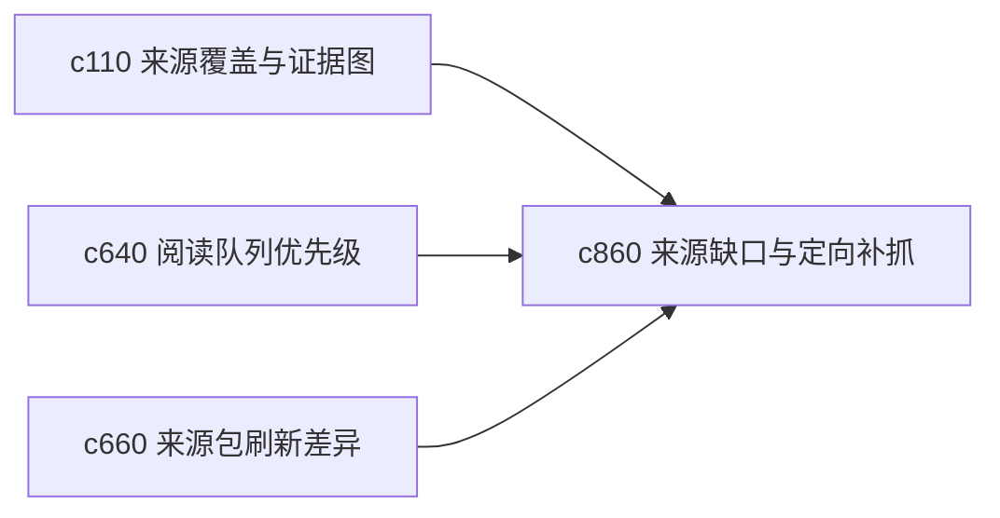

## Why

用户真正不怕“来源少”，怕的是“不知道缺在哪”。如果系统能指出是哪个子问题、哪个时间段、哪种来源类型还缺材料，补证就会高效很多。现在这层提示还不够聚焦。

## What Changes

- 定义 source coverage hole，把缺口细分到主题、问题、时间段和来源类型。
- 增加 targeted fetch suggestion，直接提示更值得补哪类来源，而不是笼统说“再搜一些”。
- 支持缺口提示和阅读队列、来源包、run 模板协同，形成下一步动作。
- 区分硬缺口和软缺口，避免把所有研究都推成无止境补料。

## Capabilities

### New Capabilities
- `source-coverage-holes-and-targeted-fetch-suggestions`: 定义来源覆盖缺口和定向补抓建议。

### Modified Capabilities
- `source-coverage-and-evidence-map`: 覆盖图需要升级到更细粒度缺口表达。
- `reading-queue-prioritization-and-guided-order`: 队列需要能围绕缺口排序。
- `source-pack-refresh-diff-and-brief`: 来源包刷新后需要标记缺口是否收窄。

## Impact

- Backend：会影响覆盖分析、缺口推断和建议生成。
- Frontend：会影响覆盖图、来源包页和下一步建议卡片。
- Dependencies：这条线会把 `c110`、`c640`、`c660` 更紧地串在一起。

