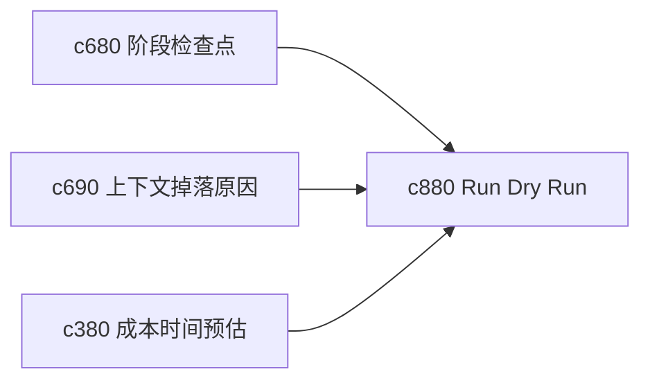

## Why

很多时候用户在真正执行前，只想先看看“如果按这个模板跑，会经过哪些步骤、可能花多久、哪里容易卡”。没有 dry run，用户要么直接开跑，要么只能靠经验猜。

## What Changes

- 定义 run plan dry run，在不正式消耗完整执行成本的前提下模拟一次 run 路径。
- 增加 simulation 结果，展示预计步骤、关键输入、可能掉落内容和高风险阶段。
- 支持 dry run 直接回接模板调整、来源补抓和阶段检查点。
- 让模拟足够快、足够粗，不把它做成另一套重执行系统。

## Capabilities

### New Capabilities
- `run-plan-dry-run-and-simulation`: 定义执行前模拟、步骤预演和风险预估视图。

### Modified Capabilities
- `run-stage-checkpoints-and-approval-gates`: 阶段门需要能在 dry run 中先预览。
- `context-assembly-drop-reasons-and-recovery-actions`: 上下文掉落原因需要提前模拟。
- `run-cost-time-estimates-and-interrupt-points`: 成本时间估算需要在 dry run 中更可感知。

## Impact

- Backend：会影响计划预演、轻量估算和风险汇总。
- Frontend：会影响 run 配置页、执行前确认面板和调整建议。
- Dependencies：这条线接在 `c680`、`c690`、`c380` 后面，是启动前的一道轻量把关。

