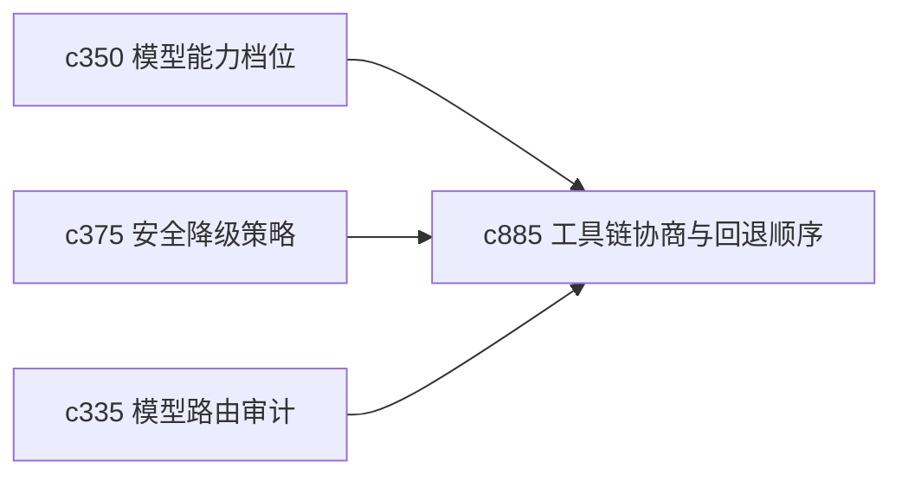

## Why

真正的执行链路往往不是单一模型或单一工具，而是一串能力协商。问题一来，不一定是“这个工具坏了”，而是“这个任务其实不适合它”。现在 fallback 更多停在失败后，协商层还不够显性。

## What Changes

- 定义 capability negotiation，让 run 在开始前先判断哪类工具或模型更适合当前任务。
- 增加 fallback order，把降级顺序和替代策略显式化。
- 支持协商结果回接路由审计、预算账本和 postmortem，而不是黑盒内部决定。
- 区分能力不匹配、容量不足和临时故障三类回退原因。

## Capabilities

### New Capabilities
- `toolchain-capability-negotiation-and-fallback-order`: 定义工具链能力协商和回退顺序。

### Modified Capabilities
- `model-capability-profiles-and-output-compatibility`: 能力档位需要参与执行前协商。
- `generation-fallback-strategies-and-safe-degradation`: 回退策略需要从执行中扩展到执行前。
- `model-route-audit-and-decision-explanations`: 路由解释需要说明协商为何如此选择。

## Impact

- Backend：会影响能力匹配、回退顺序和执行前决策记录。
- Frontend：会影响 run 配置解释、风险提示和路线说明。
- Dependencies：这条线接在 `c350`、`c375`、`c335` 后面，属于 run 控制面更深一层的显化。

