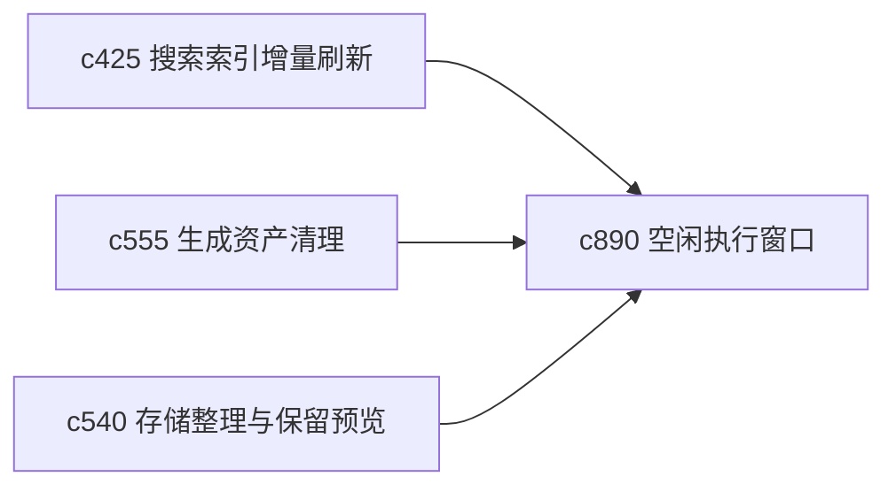

## Why

很多刷新、预热和轻量整理工作其实不需要打断用户当前操作，更适合在空闲窗口 quietly 完成。现在这类任务要么手动触发，要么挤进主路径，体验不够顺。

## What Changes

- 定义 background refresh window，把来源刷新、索引预热、轻量整理安排到用户空闲时段。
- 增加 idle execution 语义，让系统在不干扰主工作流的情况下完成低优先级维护任务。
- 支持用户设定安静窗口、暂停条件和资源上限，保持个人掌控感。
- 避免滑向长期后台自动化平台，重点仍是本地个人工作区的轻运维。

## Capabilities

### New Capabilities
- `background-refresh-windows-and-idle-execution`: 定义后台刷新窗口和空闲执行策略。

### Modified Capabilities
- `search-index-incremental-refresh-and-staleness-diagnostics`: 索引刷新需要支持空闲调度。
- `generated-asset-cleanup-and-stale-bundle-detection`: 清理任务需要能进入安静窗口。
- `storage-compaction-archive-vacuum-and-retention-preview`: 存储整理需要支持后台低扰执行。

## Impact

- Backend：会影响轻量调度、空闲检测和资源预算约束。
- Frontend：会影响设置面板、后台任务提示和静默执行反馈。
- Dependencies：这条线承接 `c425`、`c555`、`c540`，是个人工作区“顺手感”的底层优化。

