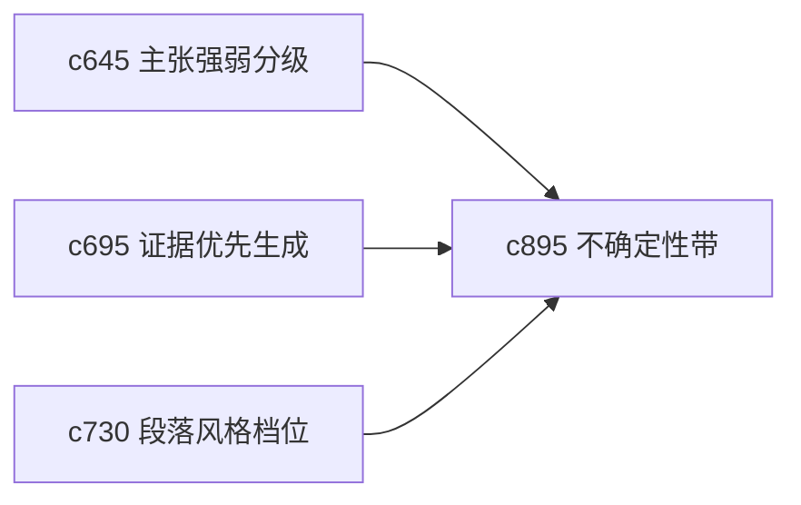

## Why

用户真正需要的不是系统永远给出一个看起来完整的答案，而是能感受到答案的把握程度。现在已经有主张强弱和风险刹车，但还缺少更贴近最终表达层的不确定性呈现。

## What Changes

- 定义 uncertainty band，在答案、段落或主张层表达“把握较高”“暂时性判断”“明显待补证”等强弱带。
- 增加 confidence shaping，让输出语气和结构自动贴合证据成熟度。
- 支持不确定性同时影响 briefing、report 和 one-pager，而不是只作用在研究页。
- 让用户可覆盖默认表达，避免系统替用户装得过分保守或过分肯定。

## Capabilities

### New Capabilities
- `uncertainty-bands-and-answer-confidence-shaping`: 定义不确定性带和答案信心塑形。

### Modified Capabilities
- `claim-strength-grading-and-evidence-weight`: 主张强弱需要传递到输出表达层。
- `evidence-first-generation-modes-and-unsafe-claim-brakes`: 风险刹车需要影响语气选择。
- `section-style-profiles-and-tone-guards`: 章节风格档位需要容纳不同信心表达。

## Impact

- Backend：会影响输出元数据、表达策略和语气建议生成。
- Frontend：会影响段落标签、风险提示和阅读感知。
- Dependencies：这条线把 `c645`、`c695`、`c730` 进一步收成更可信的最终表达。

