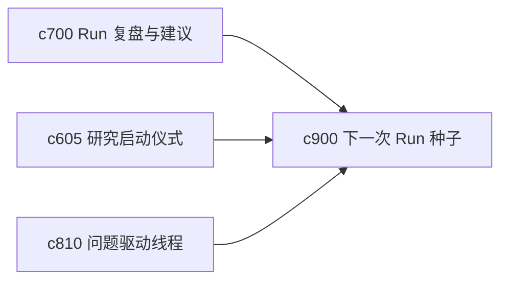

## Why

很多执行不是彼此独立的。一次 run 做完后，用户常常已经知道下次会从哪里继续、要换什么参数、要补什么来源。现在这些经验多半散在脑子里或零散备注里，没有自然接到下一次执行。

## What Changes

- 定义 next-run seed，把本次 run 的遗留问题、建议动作和推荐模板固化成下一次的启动种子。
- 增加 carry-forward brief，用简短摘要说明“下次继续时最重要的三五件事”。
- 支持 seed 绑定长线线程、问题线程和 ritual preset，而不是只跟某次 run 绑定。
- 区分“系统建议种子”和“用户手工确认种子”，避免自动接力过头。

## Capabilities

### New Capabilities
- `next-run-seeding-and-carry-forward-briefs`: 定义下一次执行种子和续跑摘要。

### Modified Capabilities
- `run-postmortem-summaries-and-recommendation-loops`: 复盘结果需要能转成下次种子。
- `research-ritual-presets-and-startup-checklists`: 启动预设需要支持消费续跑摘要。
- `question-led-research-threads-and-answer-status`: 问题线程需要能把未闭合状态带进下一次执行。

## Impact

- Backend：会影响种子对象、续跑摘要和线程绑定。
- Frontend：会影响 run 启动页、首页继续入口和线程建议卡片。
- Dependencies：这条线承接 `c700`、`c605`、`c810`，让研究执行真正形成连续回路。

