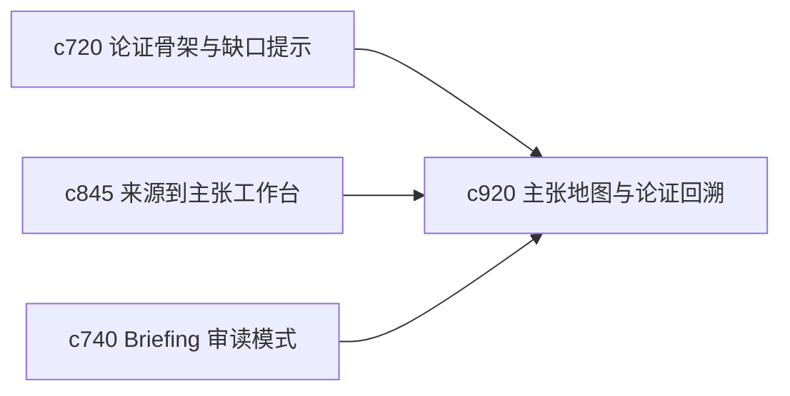

## Why

当内容越来越长、论证越来越复杂时，用户会自然想问两个问题：这篇东西到底围绕哪些核心主张展开，以及每条主张能追回哪些证据和中间推理。现在这条链还不够一眼看清。

## What Changes

- 定义 claim map view，把主张、支撑、反例和未解决争议组织成一张可浏览的论证图。
- 增加 argument traceback，允许从最终段落反向追到骨架节点、候选主张和来源证据。
- 支持 claim map 与 briefing、report、one-pager 共用，而不是为某一种输出单独做图。
- 保持视图轻量，重点是帮助审读和回看，而不是引入复杂图谱编辑器。

## Capabilities

### New Capabilities
- `claim-map-views-and-argument-tracebacks`: 定义主张地图和论证回溯路径。

### Modified Capabilities
- `outline-to-argument-skeleton-and-gap-prompts`: 骨架节点需要能稳定映射到主张图。
- `source-to-claim-extraction-workbench`: 已确认主张需要进入主张图。
- `briefing-reading-mode-and-side-by-side-evidence`: 审读模式需要支持回溯主张链。

## Impact

- Backend：会影响主张图表示、回溯路径和段落绑定。
- Frontend：会影响审读面板、主张视图和证据跳转。
- Dependencies：这条线承接 `c720`、`c845`、`c740`，会让长文复核更有抓手。

