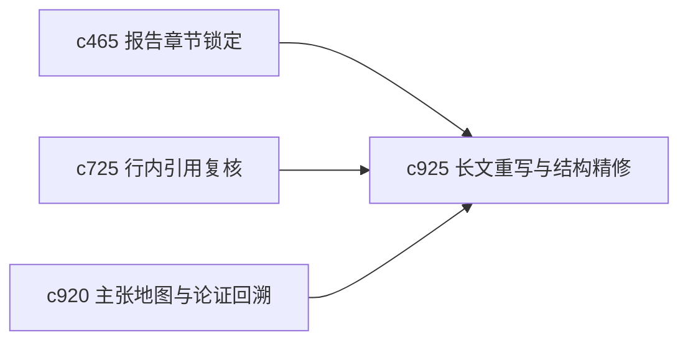

## Why

真正写长文时，第一稿通常只是把信息放进去，后面还要经历重组结构、压缩重复、拉直节奏这些 rewrite pass。现在系统已经能局部重生，但“整篇做一次结构修整”的工作面还不够明确。

## What Changes

- 定义 longform rewrite pass，把长文修订拆成结构重排、重复压缩、论证拉直、风格统一等几类 pass。
- 增加 structural refinement，支持在保留证据绑定前提下对整篇结构做较大幅度整理。
- 让 rewrite pass 与 section lock、citation queue 和 claim map 协同，避免改顺了结构却丢了证据。
- 区分“重写表达”和“重写逻辑”，让用户能精确控制改动强度。

## Capabilities

### New Capabilities
- `longform-rewrite-passes-and-structural-refinement`: 定义长文重写流程和结构精修档位。

### Modified Capabilities
- `report-section-locking-and-incremental-regeneration`: 锁定章节需要支持整篇修订中的保护边界。
- `inline-citation-review-queue-and-fix-sweeps`: 引用复核需要在重写后自动进入扫尾。
- `claim-map-views-and-argument-tracebacks`: 主张地图需要辅助判断结构是否变得更清楚。

## Impact

- Backend：会影响重写任务拆分、结构变更追踪和保护约束。
- Frontend：会影响长文编辑器、整篇修订入口和变更说明面板。
- Dependencies：这条线承接 `c465`、`c725`、`c920`，把“会生成”推进到“会修成稿”。

