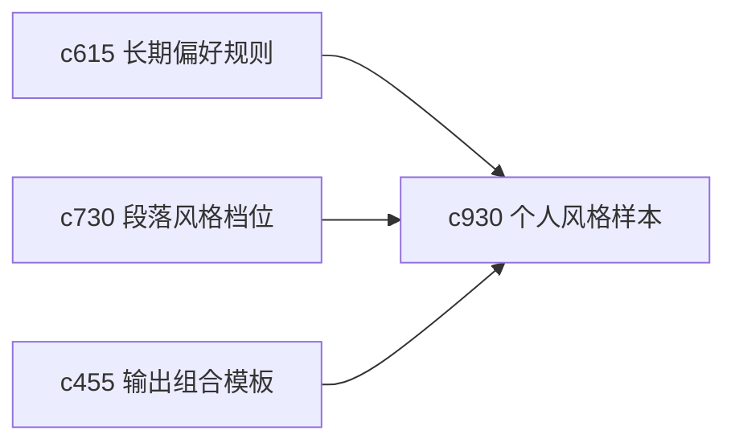

## Why

对很多个人用户来说，真正难接受的不是内容不完整，而是“这不像我会写出来的话”。系统已经有风格档位和长期偏好，但还缺一个更贴近个人写作习惯的例子层。

## What Changes

- 定义 personal style example，让用户可选少量自己认可的历史片段作为风格样本。
- 增加 voice mirroring，在保持事实与结构约束的前提下，让输出更贴近用户已有表达习惯。
- 支持按输出类型、章节角色和语气强度选择不同样本，而不是只有一个总风格。
- 让样本只服务表达层，不影响证据标准和安全刹车。

## Capabilities

### New Capabilities
- `personal-style-examples-and-voice-mirroring`: 定义个人风格样本和表达贴近策略。

### Modified Capabilities
- `steering-preferences-and-durable-user-rules`: 长期偏好需要支持风格样本层。
- `section-style-profiles-and-tone-guards`: 章节风格档位需要接住个人样本。
- `output-composition-templates-and-layout-guards`: 模板需要能声明是否启用样本贴近。

## Impact

- Backend：会影响风格样本存储、表达装配和模板参数。
- Frontend：会影响样本选择、风格说明和输出预览。
- Dependencies：这条线承接 `c615`、`c730`、`c455`，属于个人产品很自然的一层精修能力。

