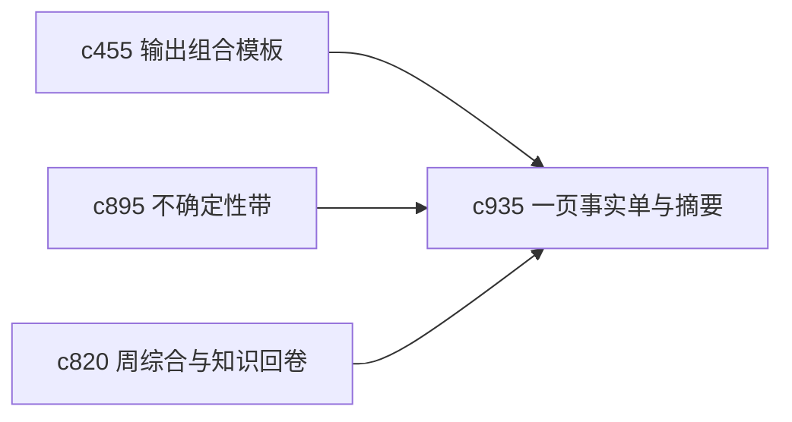

## Why

并不是每次都需要完整长文。很多时候用户只是想把一条主题压缩成一页事实单，或者快速拿到一个简洁摘要，用来回看、对比和继续推进。现在这类轻产物还不够独立成型。

## What Changes

- 定义 fact sheet 和 one-page abstract 两种轻量输出形态。
- 支持它们复用同一套主张、证据和不确定性表达，而不是重新生成一套弱化版本。
- 让轻产物可以作为长线线程、问题线程和周综合的摘要封面。
- 区分“研究内摘要”与“对外展示摘要”，优先照顾个人回看和推进。

## Capabilities

### New Capabilities
- `output-fact-sheets-and-one-page-abstracts`: 定义一页事实单和单页摘要产物。

### Modified Capabilities
- `output-composition-templates-and-layout-guards`: 模板层需要支持轻量摘要产物。
- `uncertainty-bands-and-answer-confidence-shaping`: 单页摘要需要保留不确定性表达。
- `weekly-synthesis-and-personal-knowledge-rollups`: 周综合需要能直接引用轻产物。

## Impact

- Backend：会影响轻量输出装配、模板映射和摘要元数据。
- Frontend：会影响输出列表、摘要查看器和快速导出入口。
- Dependencies：这条线接在 `c455`、`c895`、`c820` 后面，更偏个人复盘与快速回看。

