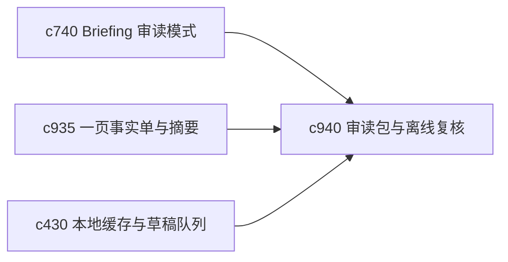

## Why

有些审读场景并不适合一直在线切面板操作，用户更希望把某个主题整理成一包可连续阅读、可带走、可稍后回来的材料。现在虽然有导出和阅读模式，但还缺“审读包”这个更明确的产物层。

## What Changes

- 定义 reading packet，把摘要、关键主张、核心来源和待复核问题装成一包连续阅读材料。
- 增加 offline review bundle，让用户在低干扰、低依赖环境里完成一轮审读。
- 支持 reading packet 回接到 briefing、fact sheet 和证据并排阅读。
- 让 bundle 仍然保有来源追溯和后续回填入口，而不是导出后完全断链。

## Capabilities

### New Capabilities
- `reading-packets-and-offline-review-bundles`: 定义审读包、离线复核包和回链语义。

### Modified Capabilities
- `briefing-reading-mode-and-side-by-side-evidence`: 审读模式需要支持打包导出。
- `output-fact-sheets-and-one-page-abstracts`: 轻产物需要能成为审读包封面。
- `local-cache-draft-queue-and-sync-preflight`: 离线复核后的回写需要接住本地草稿链路。

## Impact

- Backend：会影响审读包装配、离线回链标识和轻导出载荷。
- Frontend：会影响导出入口、审读模式和离线回归入口。
- Dependencies：这条线接在 `c740`、`c935`、`c430` 后面，是个人阅读体验的重要补件。

