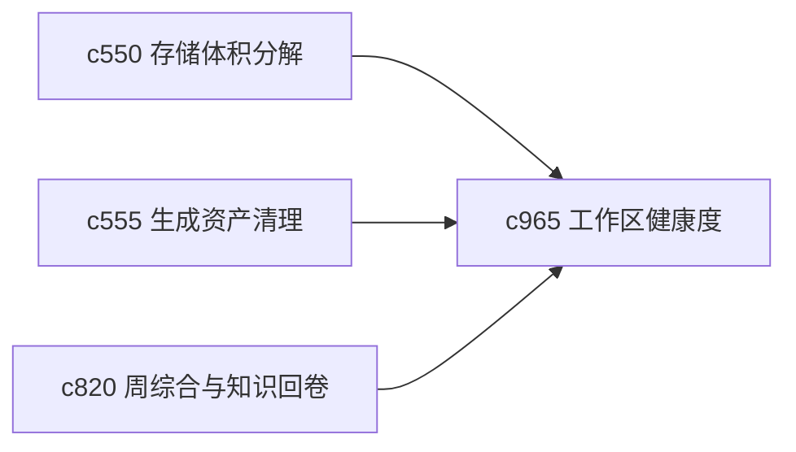

## Why

个人工作区出问题时，往往不是突然坏掉，而是慢慢变得重、乱、旧、难以继续。如果系统能提前给出“工作区正在失去可维护性”的信号，用户就更容易在变糟前做收口。

## What Changes

- 定义 workspace health score，从来源陈旧、草稿堆积、未修引用、缓存膨胀和线程失联等维度给出轻量健康信号。
- 增加 decay signal，突出那些持续恶化、需要尽快处理的问题。
- 支持 health score 回接到周综合、后台维护窗口和清理建议。
- 避免把健康分做成吓人的 KPI，更像个人工作区体检。

## Capabilities

### New Capabilities
- `personal-workspace-health-score-and-decay-signals`: 定义个人工作区健康度和衰减信号。

### Modified Capabilities
- `storage-footprint-breakdown-and-heavy-object-finder`: 存储体积需要成为健康评分的一部分。
- `generated-asset-cleanup-and-stale-bundle-detection`: 陈旧资产需要反馈到衰减信号。
- `weekly-synthesis-and-personal-knowledge-rollups`: 周综合需要能带出健康摘要。

## Impact

- Backend：会影响健康指标聚合、趋势计算和建议生成。
- Frontend：会影响首页体检卡片、维护建议和趋势查看。
- Dependencies：这条线会把 `c550`、`c555`、`c820` 串成更有行动感的维护闭环。

