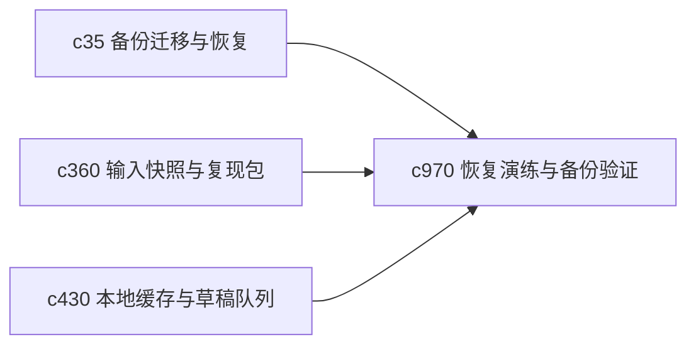

## Why

备份存在，不代表真能恢复。很多系统的问题不是没有备份，而是没人演练过恢复流程。对个人私有产品来说，这种问题更应该尽早在本地被验证掉。

## What Changes

- 定义 recovery drill，用小范围、低风险方式定期验证关键恢复路径。
- 增加 backup verification scenario，验证备份是否完整、可读、可在合理步骤内恢复。
- 支持 drill 与迁移检查、状态快照和本地缓存队列一起形成闭环。
- 强调轻量本地演练，不做复杂运维流程平台。

## Capabilities

### New Capabilities
- `recovery-drills-and-backup-verification-scenarios`: 定义恢复演练和备份有效性验证场景。

### Modified Capabilities
- `workspace-backup-migration-and-recovery`: 备份恢复流程需要有可重复演练场景。
- `run-input-snapshots-and-repro-packs`: 快照包需要能作为恢复验证样本。
- `local-cache-draft-queue-and-sync-preflight`: 本地草稿恢复需要纳入演练范围。

## Impact

- Backend：会影响恢复验证脚本、样本装配和演练结果记录。
- Frontend：会影响诊断面板、恢复演练提示和结果摘要。
- Dependencies：这条线承接 `c35`、`c360`、`c430`，属于个人私有产品必须补牢的一环。

