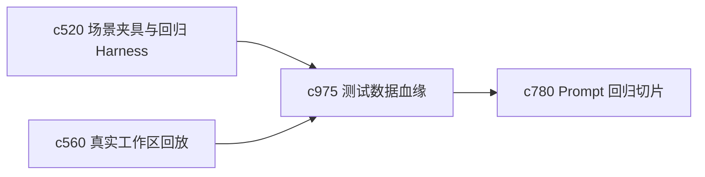

## Why

测试数据一旦过旧，很多回归看起来还绿着，实际已经脱离真实使用场景。现在有 fixture、回放和最小化数据，但“这些样本多久该更新、从哪里来的、还能代表什么”还不够清楚。

## What Changes

- 定义 test data lineage，记录测试样本的来源、清洗过程和适用范围。
- 增加 fixture refresh cadence，明确哪些基线该多久刷新一次。
- 支持 lineage 与回放、schema snapshot、prompt regression slice 互通。
- 让样本刷新保持节制，重点更新已经明显脱离当前主线的样本。

## Capabilities

### New Capabilities
- `test-data-lineage-and-fixture-refresh-cadence`: 定义测试数据血缘和基线刷新节奏。

### Modified Capabilities
- `workspace-scenario-fixtures-and-regression-harness`: 场景夹具需要表达样本血缘。
- `real-workspace-eval-dataset-capture-and-replay`: 回放数据需要标注代表性和更新时间。
- `prompt-regression-slices-and-failure-fingerprints`: 回归切片需要依赖更新鲜的样本背景。

## Impact

- Backend：会影响测试样本元数据、刷新计划和代表性说明。
- Frontend：主要影响开发诊断和基线查看，不直接影响主用户路径。
- Dependencies：这条线会把 `c520`、`c560`、`c780` 连成更可靠的评测基线链路。

