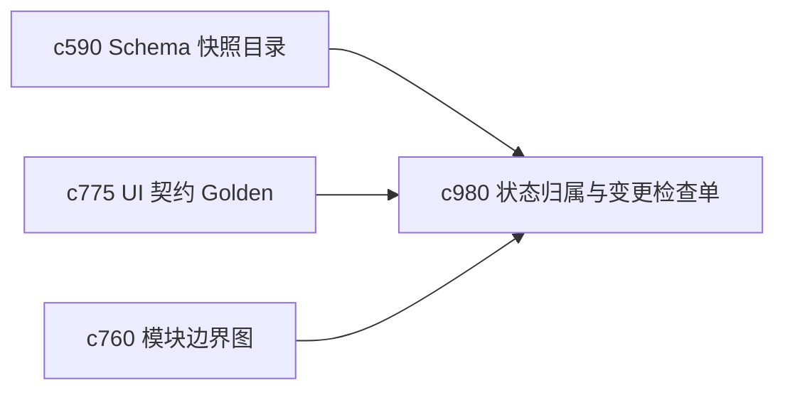

## Why

随着状态对象、Schema 快照、配置和 UI contract 越来越多，后续真正容易出问题的地方会变成“这块到底谁负责、改之前该看哪几个面”。没有归属和检查单，变更会越来越靠经验而不是靠流程。

## What Changes

- 定义 state/schema ownership，明确关键状态面、关键 schema 和关键契约各自的归属边界。
- 增加 change review checklist，让后续重构和提案实现前先过一遍关键影响面。
- 支持 checklist 挂接配置理由、UI golden、schema snapshot 和恢复演练。
- 重点服务本项目自己的持续推进，不引入团队治理或多人审批语义。

## Capabilities

### New Capabilities
- `state-schema-ownership-and-change-review-checklists`: 定义状态归属图和关键变更检查单。

### Modified Capabilities
- `schema-snapshot-catalog-and-regression-baselines`: Schema 基线需要明确归属和必查面。
- `ui-contract-golden-recordings-and-drift-alerts`: UI 契约基线需要进入变更检查单。
- `module-boundary-map-and-dependency-pruning`: 模块边界图需要为归属定义提供结构基础。

## Impact

- Backend：会影响关键状态目录、schema 元数据和变更检查输出。
- Frontend：会影响开发诊断和关键工作面验收说明。
- Dependencies：这条线会把 `c590`、`c775`、`c760` 收成一套更适合长期演进的护栏。

