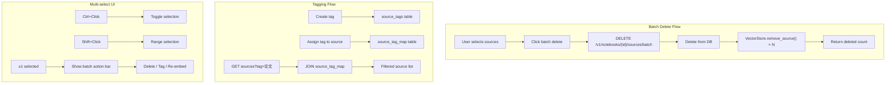

## 1. 后端批量 API
- [ ] 1.1 添加批量删除端点 `DELETE /v1/notebooks/{id}/sources/batch`
- [ ] 1.2 添加批量 re-embed 端点 `POST /v1/notebooks/{id}/sources/batch/re-embed`
- [ ] 1.3 编写批量 API 的测试

## 2. Source 标签系统
- [ ] 2.1 设计 source_tags 表（tag_id, tag_name, notebook_id）和 source_tag_map 关联表
- [ ] 2.2 添加标签 CRUD API 端点
- [ ] 2.3 添加为 source 分配/移除标签的 API
- [ ] 2.4 支持按标签筛选 source 列表
- [ ] 2.5 编写标签相关 API 的测试

## 3. 前端多选操作
- [ ] 3.1 SourcesPanel 添加多选模式（Ctrl+Click、Shift+Click）
- [ ] 3.2 全选/取消全选操作
- [ ] 3.3 多选时显示批量操作栏（删除、标签、re-embed）
- [ ] 3.4 编写多选交互的测试

## 4. 批量上传
- [ ] 4.1 文件选择器支持多文件选择
- [ ] 4.2 拖拽区域支持多文件拖入
- [ ] 4.3 批量上传进度显示（逐个上传状态）
- [ ] 4.4 编写批量上传的测试

## 5. 列表排序与筛选
- [ ] 5.1 Source 列表支持排序（名称、日期、大小、类型）
- [ ] 5.2 Source 列表支持按标签筛选
- [ ] 5.3 编写排序/筛选功能的测试

## 6. 验证
- [ ] 6.1 验证批量删除 50 个 source 的正确性和性能
- [ ] 6.2 验证标签筛选在大量 source 下的响应速度
- [ ] 6.3 验证批量上传 10 个文件的完整流程

## Architecture Flow

## Acceptance Criteria

- [ ] **AC-1**: 批量 API 端点在 `features/sources/api.py` 中定义，遵循现有 router 模式
- [ ] **AC-2**: `VectorStore.remove_source()` 在批量删除时被正确调用（每个 source 一次）
- [ ] **AC-3**: 标签数据模型使用现有的 `AsyncDBManager`（`shared/db/`）管理
- [ ] **AC-4**: 前端多选状态通过 `selectedSourceIds: Record<number, boolean>`（已存在于 WorkspaceState）管理
- [ ] **AC-5**: `just test`（后端）和 `pnpm test`（前端）通过
- [ ] **AC-6**: 手动验证：批量删除 10 个 source 后，向量存储中对应数据被清理
