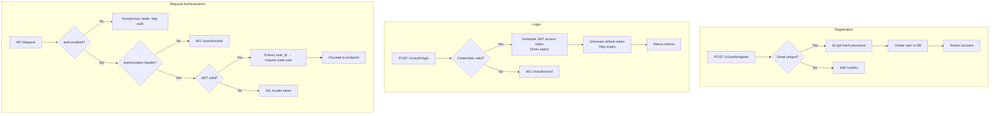
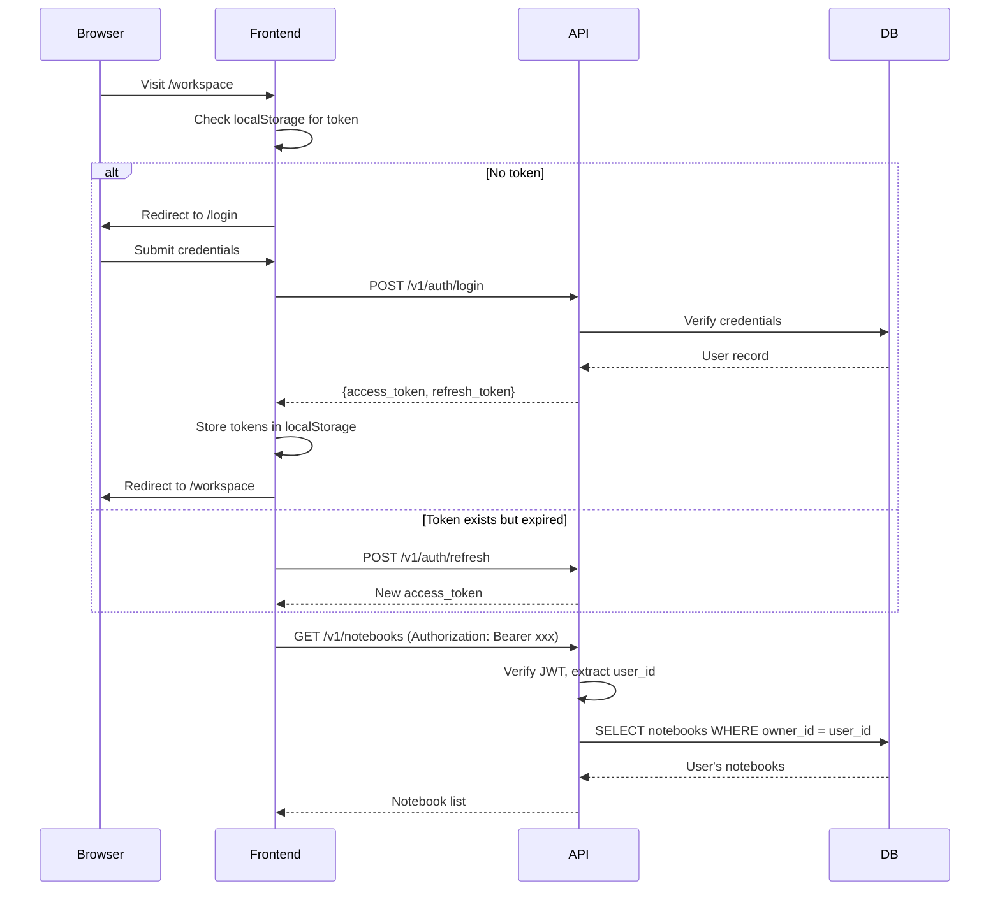

## Context

Crystalith 当前为单用户设计，无认证机制。多用户支持和协作功能都依赖用户认证作为前置条件。

## Goals / Non-Goals

- Goals:
  - 支持邮箱+密码的用户注册和登录
  - 基于 JWT 的无状态会话管理
  - 数据按用户隔离
  - 向后兼容：支持匿名模式（单用户部署不受影响）
- Non-Goals:
  - 不实现 OAuth / 第三方登录（可作为后续扩展）
  - 不实现细粒度权限（仅区分用户维度）
  - 不实现用户管理后台

## Decisions

- Decision: 使用 JWT（access token + refresh token）进行会话管理
- Alternatives considered:
  - Session cookie → 需要服务端存储，不适合无状态部署
  - API key → 简单但不适合 web 应用场景
  - OAuth2 Password Flow → 过于复杂

- Decision: 密码使用 bcrypt 哈希存储
- Alternatives considered:
  - argon2 → 更安全但依赖 C 扩展
  - scrypt → 内置但 bcrypt 社区支持更好

## Risks / Trade-offs

- JWT token 泄露风险 → access token 短有效期（15min）+ refresh token
- 迁移已有数据 → 匿名模式数据归属默认用户，后续可手动关联

## Migration Plan

1. 添加 user 表和认证 API（不影响现有端点）
2. 添加认证中间件（默认启用匿名模式）
3. 前端添加登录流程
4. 切换配置启用认证

## Architecture Flow

## Acceptance Criteria

- [ ] **AC-1**: user 表在 `shared/db/models/` 下定义，notebook 表新增 owner_id 外键
- [ ] **AC-2**: 认证 API 在 `features/auth/` 下新建 feature slice
- [ ] **AC-3**: JWT 中间件作为 FastAPI middleware 或 Depends，在 `shared/auth/` 下定义
- [ ] **AC-4**: `config/app.schema.gen.json` 更新包含 `auth` 配置段
- [ ] **AC-5**: 前端 `api/setup.ts` 的 client interceptor 自动附加 Authorization header
- [ ] **AC-6**: 匿名模式（`auth.enabled=false`）下所有现有功能不受影响
- [ ] **AC-7**: `just test` 和 `pnpm test` 通过

## Open Questions

- 是否需要邮箱验证（注册后发送验证邮件）？
- 密码强度策略？
