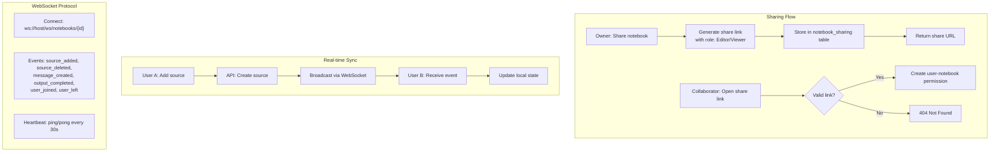
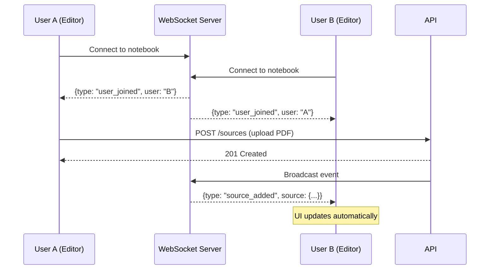

## Context

Crystalith 当前为单用户设计，所有数据无权限区分。团队使用场景需要共享 notebook 和实时协作能力。

## Goals / Non-Goals

- Goals:
  - 支持 notebook 级别的共享和权限管理
  - 实时同步关键事件（source 变更、新消息、output 完成）
  - 简单的权限模型（Owner/Editor/Viewer）
- Non-Goals:
  - 不支持字符级别的协同编辑（如 Google Docs）
  - 不支持复杂的组织/团队管理
  - 不实现离线协作和冲突解决

## Decisions

- Decision: 使用 FastAPI WebSocket 进行实时通信，事件粒度为资源级（source/message/output）
- Alternatives considered:
  - Server-Sent Events → 只支持单向，不适合需要双向通信的协作场景
  - Socket.IO → 功能完善但引入额外依赖
  - Polling → 延迟高，不适合实时协作

## Risks / Trade-offs

- WebSocket 连接数在高并发时的资源消耗 → 通过连接池和心跳管理缓解
- 依赖 auth system → 必须先实施 add-auth-system
- 并发写入冲突 → 使用乐观锁 + 最后写入胜出策略（资源级别足够）

## Migration Plan

1. 先实施 add-auth-system（前置依赖）
2. 添加 WebSocket 基础设施（可独立测试）
3. 实现共享和权限（后端 → 前端）
4. 实现实时同步（增量添加事件类型）

## Architecture Flow

## Acceptance Criteria

- [ ] **AC-1**: WebSocket 端点在 `web/app.py` 或 `features/` 下注册
- [ ] **AC-2**: notebook_sharing 表在 `shared/db/models/` 下定义
- [ ] **AC-3**: 权限检查中间件与现有 `get_db_session` Depends 模式一致
- [ ] **AC-4**: WebSocket 事件触发点在各 feature service 的 create/delete 方法中
- [ ] **AC-5**: 前端 `useWebSocket` hook 在 `shared/hooks/` 下定义
- [ ] **AC-6**: `just test` 和 `pnpm test` 通过
- [ ] **AC-7**: 手动验证：两个浏览器 tab 打开同一 notebook，一方添加 source 后另一方 < 2s 内看到更新

## Open Questions

- 是否需要协作历史/操作日志？
- 免费用户的协作人数限制？
