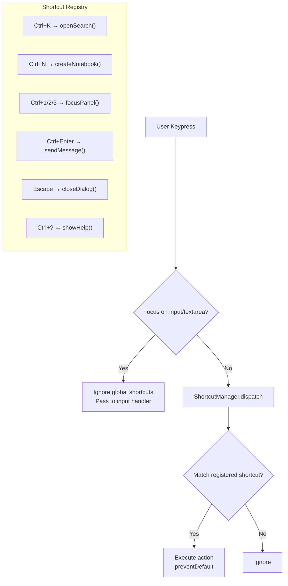

## 1. 快捷键基础设施
- [ ] 1.1 创建 useKeyboardShortcuts hook（注册、注销、分发）
- [ ] 1.2 实现快捷键冲突检测（当焦点在 input/textarea 时忽略全局快捷键）
- [ ] 1.3 创建快捷键配置映射表
- [ ] 1.4 编写 hook 的单元测试

## 2. 核心快捷键实现
- [ ] 2.1 Ctrl+K：打开搜索/命令面板
- [ ] 2.2 Ctrl+N：新建 notebook
- [ ] 2.3 Ctrl+1/2/3：切换左/中/右面板焦点
- [ ] 2.4 Ctrl+Enter：发送消息
- [ ] 2.5 Escape：关闭当前弹窗/对话框
- [ ] 2.6 编写各快捷键的交互测试

## 3. 帮助面板
- [ ] 3.1 创建 ShortcutHelpPanel 组件（Ctrl+? 触发）
- [ ] 3.2 自动从配置映射表生成快捷键列表
- [ ] 3.3 按类别分组展示（导航、操作、编辑）

## 4. 验证
- [ ] 4.1 验证所有快捷键在各面板状态下正常工作
- [ ] 4.2 验证快捷键在输入框内不误触发
- [ ] 4.3 验证快捷键帮助面板内容正确且完整

## Architecture Flow

## Acceptance Criteria

- [ ] **AC-1**: `useKeyboardShortcuts` hook 在 `features/workspace/shared/hooks/` 下定义
- [ ] **AC-2**: 快捷键不与 `WorkspaceLayout` 中已有的事件监听冲突
- [ ] **AC-3**: 当焦点在 ChatPanel 的消息输入框（textarea）时，Ctrl+K 不触发全局搜索
- [ ] **AC-4**: 快捷键帮助面板通过 `LayerProvider`（现有 `shared/layer/`）管理 z-index
- [ ] **AC-5**: `pnpm test` 通过
- [ ] **AC-6**: 手动验证：在 notebook 页面按 Ctrl+? 弹出帮助面板，列出所有快捷键
